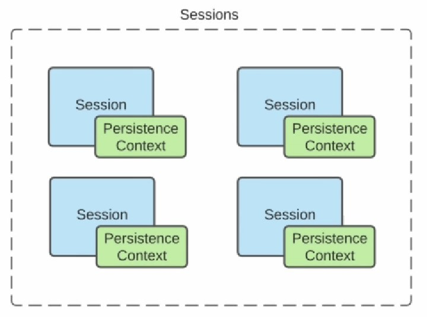
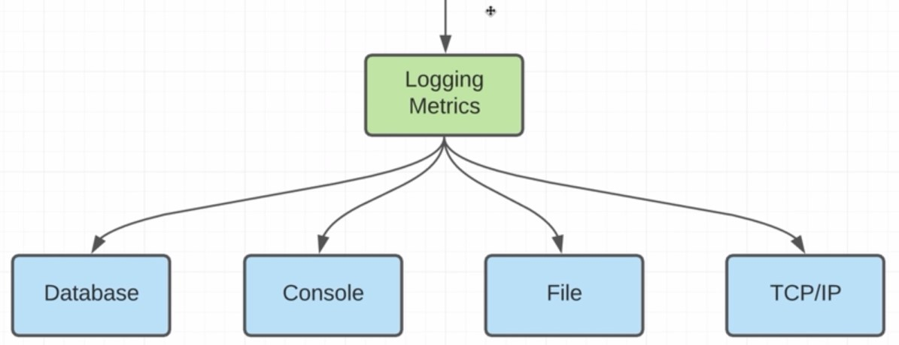
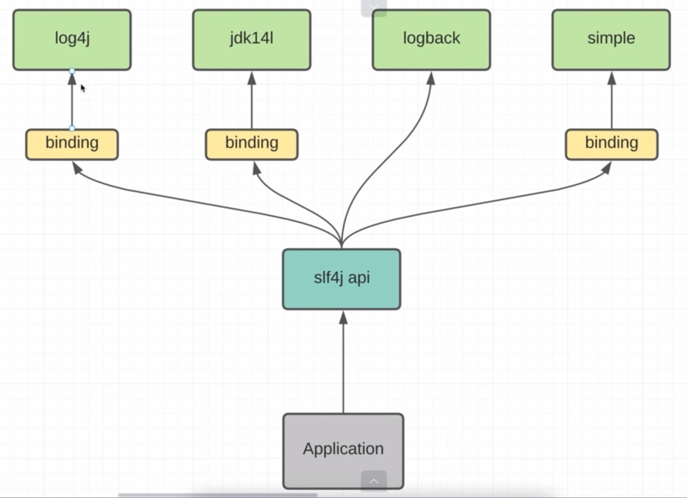
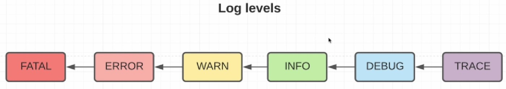
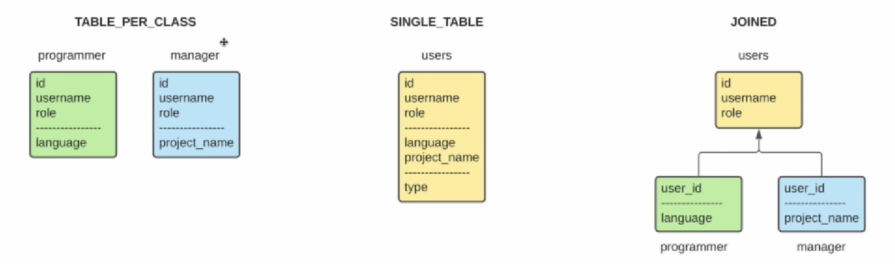
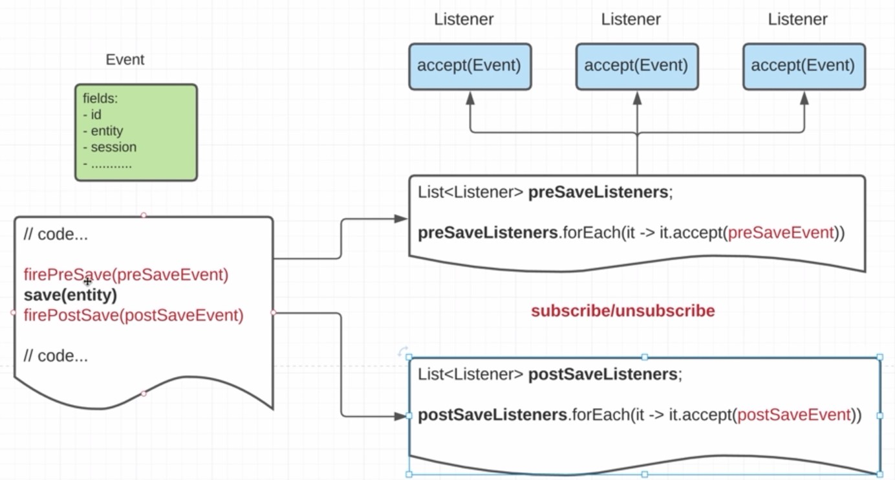
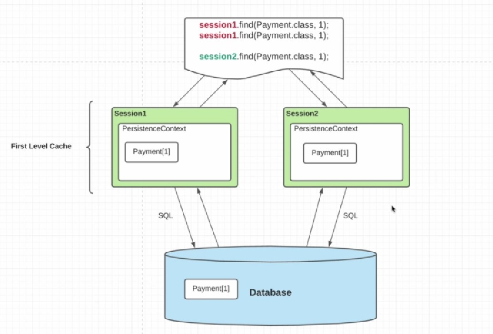
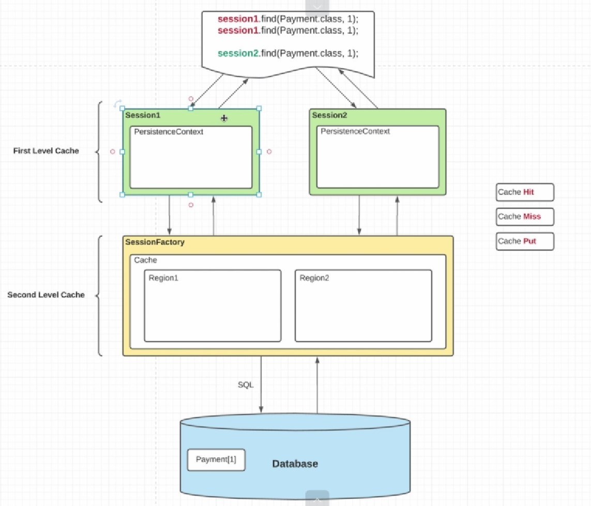

## Введение

Основные проблемы при использовании JDBC:

1. Несоответствие двух моделей. ООП (Java) и реляционная модель(СУБД)
2. Ручное написание простейших SQL запросов.
3. Отложенная загрузка данных (lazy loading). Круговая ссылка сущностей.
4. Наследование в классах. Как мапить на БД?
5. Сравнение объектов (по первичному ключу в СУБД и equals Java)
6. Кэширование. Исправление проблем Performance нашего приложения.
7. Управление транзакциями. Контроль за соединениями и запросами к БД (try, catch)


ORM (Object Relational Mapping) - процесс преобразования объектно-ориентированной модели в реляционную и наоборот.

Hibernate - инструмент, который автоматизирует процесс преобразования объектно-ориентированной модели в реляционную и наоборот (ORM Framework).

## Настройка проекта

```java
dependencies {

    //зависимость используется в Compile и Runtime фазах. В тесте и в исходном 
    implementation 'org.hibernate:hibernate-core:6.1.7.Final' 
    runtimeOnly 'org.postgresql:postgresql:42.6.0'

    //после компиляции Lombok не нужен он формирует java-код
    compileOnly 'org.projectlombok:lombok:1.18.26'
    // Lombok это в основном аннотации
    annotationProcessor 'org.projectlombok:lombok:1.18.26'

    // нужны и на стадии тестов
    testCompileOnly 'org.projectlombok:lombok:1.18.26'
    testAnnotationProcessor 'org.projectlombok:lombok:1.18.26'

    testImplementation 'org.junit.jupiter:junit-jupiter-api:5.8.1'
    testRuntimeOnly 'org.junit.jupiter:junit-jupiter-engine:5.8.1'
}
```
username VARCHAR(128) PRIMARY KEY - не автогенерируемый primary key, лучше не использовать.

Gradle устанавливать не нужно, т.к. у нас есть gradle-wrapper, который устанавливается автоматически Idea из коробки.

## Конфигурация SessionFactory

Для конфигурации SessionFactory в Hibernate используется файл hibernate.cfg.xml

```java
<?xml version='1.0' encoding='utf-8'?>
<!DOCTYPE hibernate-configuration PUBLIC
    "-//Hibernate/Hibernate Configuration DTD//EN"
    "http://www.hibernate.org/dtd/hibernate-configuration-3.0.dtd">
<hibernate-configuration>
  <session-factory>
    <property name="connection.url">jdbc:postgresql://localhost:5433/postgres</property>
    <property name="connection.username">postgres</property>
    <property name="connection.password">postgres</property>
    <property name="connection.driver_class">org.postgresql.Driver</property>
    <property name="hibernate.dialect">org.hibernate.dialect.PostgreSQLDialect</property>

    <!-- DB schema will be updated if needed -->
    <!-- <property name="hibernate.hbm2ddl.auto">update</property> -->
  </session-factory>
</hibernate-configuration>
```

dialect позволяет Hibernate сконфигурировать дополнительные типы, функции, view и так далее, которые специфичны для определенной БД.

```java
 public static void main(String[] args) {
        Configuration configuration = new Configuration();
        configuration.configure();

        try (SessionFactory sessionFactory = configuration.buildSessionFactory();
             Session session = sessionFactory.openSession()) {
            System.out.println("OK");
        }
    }
```

В классе Configurate содержится всё, что нужно для создания SessionFactory - аналога ConnectionPool из JDBC.

Как и у ConnectionPool должен быть один объект SessionFactory на всё приложение.

Session - обертка над классом Connection.

## Entity

Для того, чтобы класс стал сущностью необходимо несколько правил:

- POJO - Plain Old Java Object. Все поля private, getter, setter ко всем полям.
- сущность не может быть Immutable, то есть нельзя объявлять final поля.
- сам класс не может быть final, потому что Hibernate работает с Proxy.<BR> 
Proxy работает по принципе CGLIB - code generation library, который создает наследников нашего класса
- должен быть конструктор без параметров. Т.к. Hibernate использует Reflection API для создания сущностей и последующей инициализации через setter или напрямую через Reflection API устанавливает свойства для полей.

@Entity - аннотация, чтобы класс стал Hibernate-сущностью. Каждая сущность должна иметь Id, поэтому одно поле
нужно пометить аннотацией @Id

Поле @Id должно быть serializable.

В Hibernate необходимо вручную работать с транзакциями 
```java
 public static void main(String[] args) {
        Configuration configuration = new Configuration();
        configuration.configure();

        try (SessionFactory sessionFactory = configuration.buildSessionFactory();
             Session session = sessionFactory.openSession()) {

            session.beginTransaction();

            User user = User.builder()
                    .username("ivan@mail.ru")
                    .firstname("Ivan")
                    .lastname("Ivanov")
                    .birthDate(LocalDate.of(2000, 1, 12))
                    .age(20)
                    .build();

            session.save(user);
            session.getTransaction().commit();
        }
    }
```

Чтобы Hibernate отслеживал сущность необходимо необходимо добавить соответствующий класс в конфигурацию

```java
 configuration.addAnnotatedClass(User.class);
```

Либо прописать mapping класса в xml:
```java
  <mapping class="com.dmdev.entity.User"/>
```

@Table(name = "Users") - указываем к какой таблице относится данная сущность.

Чтобы настроить маппинг названия полей класса и колонок в БД, необходимо установить

```java
configuration.setPhysicalNamingStrategy(new CamelCaseToUnderscoresNamingStrategy());
```

Либо использовать аннотацию @Column(name = "birth_day"). Здесь так же можно указать много информации: nullable, точность, можно вставлять или нет, размер. На основании этой метаинформации Hibernate поддерживает автосоздание DDL.

## Класс Session

Интерфейс Session по сути обертка над классом Connection, которая работает с сущностями и отслеживает их жизненный цикл.

При вызове метода save() с помощью ReflectionAPI формируется SQL-запрос.

```java
  @Test
    void checkReflectionApi() throws SQLException, IllegalAccessException {
        User user = User.builder()
                .username("ivan@mail.ru")
                .firstname("Ivan")
                .lastname("Ivanov")
                .birthDate(LocalDate.of(2000, 1, 12))
                .age(20)
                .build();

        String sql = """
                insert
                into
                %s
                (%s)
                values
                (%s)
                """;

        String tableName = Optional.ofNullable(user.getClass().getAnnotation(Table.class))
                .map(tableAnnotation -> tableAnnotation.schema() + "." + tableAnnotation.name())
                .orElse(user.getClass().getName());

        Field[] declaredFields = user.getClass().getDeclaredFields();
        String columnName = Arrays.stream(declaredFields)
                .map(field -> Optional.ofNullable(field.getAnnotation(Column.class))
                        .map(Column::name)
                        .orElse(field.getName()))
                .collect(Collectors.joining(", "));

        String columnValues = Arrays.stream(declaredFields)
                .map(fields -> "?")
                .collect(Collectors.joining(", "));

        String setSql = sql.formatted(tableName, columnName, columnValues);
        System.out.println(setSql);

        Connection connection = null;
        PreparedStatement preparedStatement = connection.prepareStatement(setSql);
        for (Field declaredField : declaredFields) {
            declaredField.setAccessible(true);
            preparedStatement.setObject(1, declaredField.get(user));
        }
    }
```

В Hibernate это всё происходит автоматически под капотом, достаточно лишь правильно описать сущность в соответствующем классе.

## Type Converter

В классе Configuration есть поле 
'''java
private final List<BasicType<?>> basicTypes = new ArrayList<>();
'''

Это список всех типов, которые может поддерживать Hibernate и преобразовывать один в другой.
Есть методы wrap() и unwrap(), которые преобразуют типы Java в типы SQL и наоборот.
А так же Descriptorы, которые устанавливают значения в JDBC запрос.

Enum можно хранить в БД в виде String (EnumType.STRING) или int (EnumType.ORDINAL). int плохой способ хранения Enum, так как при изменении
порядка значений смысловая сущность записанных данных в БД будет утеряна.

Все Enum наследуются от класса Enum из пакета java.lang, поэтому нельзя наследовать другие классы, а только реализовывать интерфейсы.

```java
    @Enumerated(EnumType.STRING) // по умолчанию EnumType.ORDINAL, т.е. Enum преобразуется в int
    private Role role;
```

По сути преобразование Java классов в SQL типы происходит с помощью соответствующих реализаций interface Type.

## Custom attribute converter

Если нужно преобразовать свой класс в типы SQL можно реализовать свой Converter

В новых классах работы с датами нет методов перехода к старым, а в старых есть, чтобы когда-нибудь отказаться от старых типов.

```java
public class BirthDayConverter implements AttributeConverter<Birthday, Date> {
    @Override
    public Date convertToDatabaseColumn(Birthday attribute) {
        return Optional.ofNullable(attribute)
                .map(Birthday::birthDate)
                .map(Date::valueOf)
                .orElse(null);
    }

    @Override
    public Birthday convertToEntityAttribute(Date dbData) {
        return Optional.ofNullable(dbData)
                .map(Date::toLocalDate)
                .map(Birthday::new)
                .orElse(null);
    }
}


@Convert(converter = BirthDayConverter.class)
@Column(name = "birth_date")
private Birthday birthDate;
```
Чтобы не прописывать @Convert(converter = BirthDayConverter.class) в сущность, можно настроить конфигурацию Hibernate.

```java
 configuration.addAttributeConverter(new BirthDayConverter(), true);
```

Либо над конвертером
```java
@Converter(autoApply = true)
public class BirthDayConverter implements AttributeConverter<Birthday, Date> { ...
}
```

## Custom user type

Предположим в БД есть колонка типа JSONB, которой нет аналога в Java-SQL. Тогда нам нужно создать свой собственный тип реализуя 
интерфейс Type, либо UserType.

Главные методы в них это nullSafeGet и nullSafeSet, которые работают с ResultSet и устанвливают значения в PrepareStatement.

Чтобы не переопределять все методы вручную можно воспользоваться библиотекой Hibernate Types

```java
public class User {
        ...
    //    @Type(type = "com.vladmihalcea.hibernate.type.json.JsonBinaryType")
        @Type(type = "jsonb")
        private String info;
}
```

Так же нужно зарегистрировать тип в configuration
```java
 configuration.registerTypeOverride(new JsonBinaryType());
```

при этом объект просто добавляется в коллекцию basicTypes.

Можно указать короткое имя над классом (пакетом) 

```java
@TypeDef(name = "dmdev", typeClass = JsonBinaryType.class)
public class User {
    ...

    @Type(type = "dmdev")
    private String info;
}
```

## Методы update, delete, get

Метод Session.update() обновляет пользователя, если его нет, то пробрасывает exception.

В Hibernate отложенная отправка запросов, он старается максимально отодвинуть момент открытия транзакции и общения с БД. Чтобы можно было собрать несколько SQL-запросов и отправить их batch. Поэтому запросы выполняются после того как транзакция будет закомичена.

Метод Session.saveOrUpdate() сначала делает запрос select и потом так же откладывает вставку или обновление до коммита.

Метод Session.delete() удаляет пользователя по его идентификатору. У каждой сущность должно быть поле id, чтобы не нарушать первую нормальную форму. При этом так же сначала выполняется select-запрос по идентификатору, а потом уже отложенное удаление.

Session.get(User.class, id) - возвращает сущность по id. Передаётся именно пара - класс и id, т.к. id могут дублироваться в разных таблицах.

```java
 @Test
    void checkGetReflectionApi() throws SQLException, NoSuchMethodException, InvocationTargetException, InstantiationException, IllegalAccessException, NoSuchFieldException {
        PreparedStatement preparedStatement = null;
        ResultSet resultSet = preparedStatement.executeQuery();
        resultSet.getString("username");
        resultSet.getString("lastname");

        Class<User> clazz = User.class;

        Constructor<User> constructor = clazz.getConstructor();
        User user = constructor.newInstance();
        Field usernameField = clazz.getDeclaredField("username");
        usernameField.setAccessible(true);
        usernameField.set(user, resultSet.getString("username"));
    }
```

Необходимо анализировать аннотации чтобы смапить значения из ResultSet в поля сущности, а так же необходимые конвертеры, чтобы преобразовать SQL-типы в соответствующий тип поля сущности.

Универсальность в подобных фреймворках достигает за счёт ReflectionAPI. Нам всё равно как мы создаём наши классы, не нужно переопределять интерфейсы, наследоваться от готовых классов в Hibernate или Spring. Достаточно создать сущность и расставить нужные аннотации - добавить мета-информацию, всё остальное Hibernate сделает за нас.

## Entity persister

Любая Session знает о SessionFactory, которая её создала. С помощью метода getFactory().getMetamodel() мы получаем 
метаданные о сессии и сущностях. В Map EntityPersisterMap хранится полное имя класса как ключ и соответствующий SingleTableEntityPersister. Именно он загружает, сохраняет, обновляет в нашу БД сущность.

Так же в метаданных хранится объект TypeConfiguration, в которой содержится информация о всех типах и реализаций их UserType.

EntityPersister мапит SQL запросы с нашей сущностью.


Создаётся SessionFactory - один единственный объект на всё приложение. В нём есть MetaModel, которая строится на основании всех классов и сущностей, которые мы туда добавили. Плюс BasicTypes загруженные по умолчанию из Hibernate для стандартных типов данных, либо созданные нами. На каждую сущность, которая обязана иметь id мапится EntityPersister, он знает как совершать CRUD операции для каждой сущности.

В Hibernate широко используется модель event - listner, то есть каждый listner вызывается при возникновении определенного event.

## First Level Cashe

Класс сущности является ключем по которому мы получаем соответствующий EntityPersister. 

В Hibernate реализованы механизмы кэширования, чтобы меньше раз обращаться к БД. Это First Level Cashe, он есть всегда по умолчанию и никак его не отключить. 

В объекте Session есть поле persistenceContext - кэш. В объекте класса PersistenceContext есть ссылка на сессию, которой он принадлежит. У каждой сессии свой PersistenceCentext. 

В PersistenceContext есть ассоциативный массив entitiesByKey, ключ - объект EntityKey с полями identifier - id, hashcode, entityPersister.
значение - объект который получен из БД.

Сущности в persistenceContext помещаются после вызова методов у объекта Session - save, get и другие.

Для удаления объектов из кэша есть два метода:

- Session.evict(user) - удаление одного объекта
- Session.clear() - удаление всех объектов
- Session.close() - закрыть сессию

Если после получения сущности из БД мы поменяем в ней поля, то эти изменения отразятся и на БД. То есть перед commit будет вызван 
запрос update.

```java
    User user = session.get(User.class, "ivan@mail.ru");
    user.setLastname("Sidorov");
```

Таким образом изменения во всех сущностях, содержащихся в persistenceContext будут автоматически Hibernate производится и в БД.
Это называется dirty session.

Session.isDirty() показывает были ли изменения в сущностях, ассоциированных с данной сессией.

Flush - сливание всех изменений в БД.

Session.flush() - сливает все изменения объектов persistenceContext в БД.



В metaModel есть много объектов Session, нечто вроде SessionPool и в каждой есть свой PersistenceContext. Каждая сущность может быть ассоциирована со своим PersistenceContext и в каждом PersistenceContext будет своё состояние этой сущности.


Отличие Detached от Transient, в том что сущность была в Persistent-состоянии.

@UtilityClass - создаёт private-конструктор и final-класс.

Session.refresh(user) - происходит запрос в БД и все полученные данные накладываются на user.

```java
User freshUser = session.get(User.class, user.getUsername());
user.setUsername(freshUser.getUsername);
```

Session.merge(user) - получает пользователя из БД и записывает в него значения из user. Т.е. текущий объект главнее полученного из БД. При этом объект помещается в состояние Persistence.

```java
User mergeUser = session.get(User.class, user.getUsername());
mergeUser.setUsername(user.getUsername);
```

PostgreSQL по умолчанию имеет уровень изолированности транзакций READ_COMMITED. Поэтому мы не увидим изменений из нашего кода, пока не сделаем commit транзакции.

## Java Persistence API

Java Persistence API (JPA) - спецификация Java, которая предоставляет набор интерфейсов/аннотаций для возможности сохранять в удобном виде Java объекты в базу данных и, наоборот,  извлекать информацию из баз данных в виде Java объектов (ORM).

Hibernate (ORM framework) - это одна из самых распространенных JPA реализаций.

Класс Session наследует EntityMenager и добавляет свои методы, схожие с методами EntityMenager.

- get - find
- evict - detach
- save - persist
- delete - remove

## Logging



Логгирование - сообщения, которые может анализировать программист

Метрики 
- как часто код обращается в БД 
- RPS (Request per second) 
- Latency - как долго ждёт пользователь после запроса в БД

В реальных приложениях логи часто отправляются на специальный сервер который знает как их обрабатывать

EKL - ElasticSearch, Logstash, Kibana - логи

Prometheus, Grafana - метрики



Для некоторых логгеров нужен адаптер (binding)



Каждый логгер настраивается специальным текстовым или log4j.xml файлом.

```java
<?xml version="1.0" encoding="UTF-8" ?>
<!DOCTYPE log4j:configuration SYSTEM "log4j.dtd">

<log4j:configuration>
    <appender name="console" class="org.apache.log4j.ConsoleAppender">
        <param name="target" value="System.out"/>
        
        <layout class="org.apache.log4j.PatternLayout">
            <param name="conversionPattern" value="[%d{HH:mm:ss, SSS} %p [%c: %L] %m%n]"/>
        </layout>
    </appender>
    
    <root>
        <level value="info"/>
        <appender-ref ref="console"/>
    </root>
</log4j:configuration>
```

Appender берет log-сообщение и отправляет его туда, куда мы укажем.

Формат задаётся паттерном layout.

Класс log4j.ConsoleAppender реализует интерфейс Appender.
Главная задача любого логгера переопределить метод 
```java
void doAppend (LoggingEvent event)
``` 

LoggingEvent - основной объект log-сообщения, в нем содержатся само сообщение, поток, уровень логгирования и т.д.

root - сам логгер. Указываем log-level и ссылку на appender.

```java
    private static final Logger log = LoggerFactory.getLogger(HibernateRunner.class);
```
Обычно создаётся один логгер для класса.

В лог сообщениях не следует использовать конкатенацию строк, нужно использовать varargs. 

```java
log.info("User entity is in transient state, object: {}", user);
```

{} - в них подставляются по порядку значения varargs.

 При вызове логгера проверяется его уровень логгирования и уровень root-логгера, часть сообщений просто не будут выводится, если их уровень логгирования ниже чем установленный. Получается повышение производительности, т.к. в реальных приложениях огромное колличество логгеров.

log может принимать объект throwable и пробрасывать его дальше
```java
catch (Exception exception) {
                log.error("Exception occurred", exception);
                throw exception;
}
```

## File Appender

```java
 <appender name="file" class="org.apache.log4j.RollingFileAppender">
        <param name="file" value="hibernate-starter.log"/>

        <param name="append" value="true"/>
        <param name="maxFileSize" value="1KB"/>
        <param name="maxBackupIndex" value="10"/>

        <layout class="org.apache.log4j.PatternLayout">
            <param name="conversionPattern" value="[%d{HH:mm:ss, SSS} %p [%c: %L] %m%n]"/>
        </layout>

        <filter class="org.apache.log4j.varia.LevelRangeFilter">
            <param name="LevelMin" value="ALL"/>
        </filter>
    </appender>
```

root логгер должен быть обязательно и один, своих логгеров может быть сколько угодно.

```java
  <logger name="com.dmdev" additivity="false">
        <level value="info"/>
        <appender-ref ref="console"/>
    </logger>
```
additivity - должны ли повторятся сообщения в иерархии логгеров.

Иерархия возможна и по папкам, которые отслеживаются.

На практике много Appenderов и один - два логгера. Напримет, ConsoleAppender нужен только во время разработки, в production в нём нет нужды.

Аннотация @Slf4j из пакета lombok заменяет объявление переменной логгера с названием log.

## Embedded components

Embedded components - встраиваемые компоненты.

Может понадобиться объединить часть полей сущности в одно поле. Но мы не хотим создавать в SQL свой встраиваемый тип, тем более не все СУБД это поддерживают. Следовательно проще создать объекты на уровне Java, а в SQL оставить всё как есть.
Либо в Legacy БД есть составные первичние, вторичные ключи, которые нужно объединить в один объект, чтобы работать с одним ключем.

Для встраиваемых классов все те же правила, что и для сущностей. Так же нужно добавить аннотацию @Embeddable

```java
@Data
@NoArgsConstructor
@AllArgsConstructor
@Builder
@Embeddable
public class PersonalInfo {
    private String firstname;
    private String lastname;

    @Column(name = "birth_date")
    private Birthday birthDate;
}
```

Все аннотации, которые используются в сущностях можно использовать и в встраиваемых компонентах.

В классе Configuration за встраиваемые компоненты отвечает класс EmbeddedComponentType extends ComponentType. Для каждого Embedded component создаётся объект класса ComponentType.

Происходит двухфазовая инициализация:
- метод hydrate - получаем все необходимые значения по колонкам из ResultSet
- метод resolve - получаем массив всех значений соответствующих колонок и на основании массива создаём соответствующие сущности.

При сохранении наоборот вызывается метод nullSafeSet

Может возникнуть ситуация, что название полей в Embedded components не соответствует названиям колонок в БД. Тогда нужно использовать повторяющуюся аннотацию @AttributeOverride. Повторяющаяся - значит можно использовать несколько аннотаций над одним полем.

```java
public class User {

    @Embedded
        @AttributeOverride(name = "birthDate", column =  @Column(name = "birth_date"))
        private PersonalInfo personalInfo;
        
}
```

## Первичные ключи

Натуральные первичные ключи редко встречаются на практике, так как по сравнению с синтетическими (автогенерируемыми) происходит потеря производительности и сложно менять бизнес-логику.


## Стратегия GenerationType.AUTO

Использует одну из трёх стратегий по умолчанию установленную для БД, либо для определённого диалекта. В Postgres - sequence.

## Стратегия GenerationType.IDENTITY

Таблица сама определяет как формировать id. BIGSERIAL - тип данных Postgres, который автоматически формирует id при вставке в таблицу

```sql
create table all_sequence
(
    id BIGSERIAL PRIMARY KEY
)
```

```java
   @Id
    @GeneratedValue(strategy = GenerationType.IDENTITY)
    private Long id;
```

В сущности можно добавлять метаинформацию
@Column(unique = true)

## Стратегия GenerationType.SEQUENCE

Для формирования идентификатора можно использовать последовательности:

```sql
create sequence users_id_seq
owned by users.id;
```

```java
 @Id
    @GeneratedValue(generator = "user_gen", strategy = GenerationType.SEQUENCE)
    @SequenceGenerator(name = "user_gen", sequenceName =  "users_id_seq", allocationSize = 1)
    private Long id;
```

В данном случае потребуется два запроса в БД, один для получения очередного id из последовательности, второй - запрос на вставку.
В отличии от GenerationType.IDENTITY, где требуется один запрос.

При использовании GenerationType.SEQUENCE в случае вызова метода saveOrUpdate выполняется запрос к БД на получение id, и полученный id приваивается полую у сущности. В этом случае сущность переходит из состояния Transient в Persist. Наличие id обязательное условие того, что сущность находится в состоянии Persist и может быть помещена в кэш первого уровня. 

При использовании натуральных ключей запросы в БД отправляются только при вызове flush(), либо commit транзакции. Осуществляется один запрос на insert, в котором таблица сама генерирует id и он записывается в сущность.

## Стратегия GenerationType.TABLE

Стратегия GenerationType.TABLE используется если БД не поддерживает автоматическую генерацию id или последовательности. 

```sql
create table all_sequence
(
    table_name VARCHAR(32) PRIMARY KEY ,
    pk_value BIGINT NOT NULL
)
```

```java
@GeneratedValue(generator = "user_gen", strategy = GenerationType.TABLE)
@TableGenerator(name = "user_gen", table =  "all_sequence", pkColumnName = "table_name",
            valueColumnName = "pk_value", allocationSize = 1)
```

При этом
Формируется запрос пессимистичной блокировки строки
Hibernate: 
   select
        tbl.pk_value 
    from
        all_sequence tbl 
    where
        tbl.table_name=? for update
            of tbl
Вставляем значения из @TableGenerator и начальное значение по умолчанию 0 (можно установить)
Hibernate: 
    insert 
    into
        all_sequence
        (table_name, pk_value)  
    values
        (?,?)
Инкрементируем начальное значение и присваиваем сущности id = 1
Hibernate: 
    update
        all_sequence 
    set
        pk_value=?  
    where
        pk_value=? 
        and table_name=?

Опять же для Hibernate не нужно делать insert, чтобы сущность перешла в Persistence состояние, главное присвоить ей id. Далее dirty-сессия может быть слита методами flush() и commit(), а так же другими способами.

Генерация Id с помощью таблицы менее производительна т.к. мы блокируем таблицу на запись, а это требует ресурсы.

## EmbeddedId

Первичные ключи могут быть составными.

```sql
CREATE TABLE users
(
    username VARCHAR(128) UNIQUE ,
    firstname VARCHAR(128),
    lastname VARCHAR(128),
    birth_date DATE,
    role VARCHAR(32),
    info JSONB ,
    PRIMARY KEY (username, firstname, lastname) // по умолчанию все эти поля NOT NULL
);
```

Внесем исправление в сущность с помощью аннотации EmbeddedId.

```java
    @EmbeddedId
    @AttributeOverride(name = "birthDate", column =  @Column(name = "birth_date"))
    private PersonalInfo personalInfo;
```

Класс, который выступает в роли первичного ключа должен реализовывать интрефейс serializable
При этом нужно не забывать генерировать serialVersionUID.

```java
@Data
@NoArgsConstructor
@AllArgsConstructor
@Builder
@Embeddable
public class PersonalInfo implements Serializable {
    @Serial
    private static final long serialVersionUID = 9154080960028288028L;

    private String firstname;
    private String lastname;

    private Birthday birthDate;
}
```

При вызове saveOrUpdate сначала делается select, а затем уже при flash() или commit() insert или update.
При вызове get формируется select 
```java
Hibernate: 
    select
        user_.birth_date,
        user_.firstname,
        user_.lastname,
        user_.info as info4_0_,
        user_.role as role5_0_,
        user_.username as username6_0_ 
    from
        users user_ 
    where
        user_.birth_date=? 
        and user_.firstname=? 
        and user_.lastname=?
```

Такие первичные ключи вызывают трудности на разных слоях приложения. Лучше использовать Identity, когда таблица сама формирует ключ.

## Other basic annotation

**@Access()**
- AccessType.FIELD - по умолчанию. Hibernate будет использовать ReflectionAPI, для доступа к полям нашей сущности.
- AccessType.PROPERTIES - более ранний способ доступа к полям через getter и setter, Hibernate будет использовать ReflectionAPI для доступа к геттерам и сеттерам, а не напрямую к полям. И аннотации ставятся не над полями, а над геттерами.

**@Transient**
помечается поле, которое не нужно сохранять в БД. На практике лучше не использовать, а хранить в сущности только те поля, которые мапятся на соответствующие поля в БД

До ввода в Java 1.8 DateTimeAPI мы использовали класс Date, но в БД есть три типа даты: Date, Time, TimeStamp.

```java
@Temporal(TemporalType.TIMESTAMP)
private LocalDateTime localDateTime;

@Temporal(TemporalType.DATE)
private LocalDate localDate;

@Temporal(TemporalType.TIME)
private LocalTime localTime;
```

**@ColumnTransformer** - трансформируем колонку (вкрапления в SQL) при чтении и записи. Например, вызов функции encrypt() и decrypt(). Аннотация повторяемая.

**@Formula("decrypt(creditcard_num)")** - добавляем sql скрипт, работает только на чтение, не на запись.

## Маппинг ассоциаций

### Many to one

```sql
CREATE TABLE users
(
    id BIGSERIAL PRIMARY KEY ,
    username VARCHAR(128) ,
    firstname VARCHAR(128),
    lastname VARCHAR(128),
    birth_date DATE,
    role VARCHAR(32),
    info JSONB ,
    company_id INT REFERENCES company (id)
);

CREATE TABLE company (
    id SERIAL PRIMARY KEY ,
    name VARCHAR(64) NOT NULL UNIQUE
);
```

Добавляем новую сущность:

```java
@Data
@NoArgsConstructor
@AllArgsConstructor
@Builder
@Entity
public class Company {

    @Id
    @GeneratedValue(strategy = GenerationType.IDENTITY)
    private Integer id;

    private String name;
}
```

И поле в сущность User

```java
    @ManyToOne
    //@JoinColumn(name = "company_id") умполчанию название сущность с маленькой буквы + _id
    private Company company;
```

Для работы с ManyToOne есть специальный BasicType - ManyToOneType. Данный метод содержит enum тип ков, котоыреогда вит соответствующую аннотацию занимается формированием запросов в БД.

## Fetch types

При получении сущности в которой установлена связь с другой сущностью Hibernate делает join в SQL-запросе.

Возможны два варианта: left outer join и inner join. При inner join те user, у которых нет company отсеятся, но если на этом поле стоит NOT NULL - @ManyToOne(Optional = false), то это поможет выиграть в производительности.

Так же в аннотации @ManyToOne есть свойство fetch
- FetchType.EAGER - жадный по умолчанию для не коллекций
- FetchType.LAZY - ленивый по умолчанию для коллекций

В случае LAZY вместо объекта ссылка присваивается на HibernateProxy объект. Это класс, который создаётся динамически во время выполнения, на этапе компиляции его нет.

При этом proxy-объект будет инициализирован только тогда, когда мы попросим это поле у связанной сущности.

В случае LAZY необходим постоянный доступ к сессии, иначе может возникнуть ошибка LazyInitializationException

## Hibernate Proxy

Есть два варианта создания Proxy:
- Dynamic через реализацию интерфейсов необходимого класса
- extends от необходимого класса, этот вариант использует Hibernate. По этой причине у proxy объекта все те же поля, что и у класса, но они никогда не будут проинициализированы - null.

Hibernate может использовать разные библиотеки для создания прокси:
- ByteBuddy (используется сейчас)
- Javaassist (заменил cglib, но все еще есть в исходниках)
- Cglib (использовался в первых версиях Hibernate)

Каждый proxy-объект хранит сессию.

В proxy-объекте Hibernate есть поля id, название объекта, ссылка на объект (null до инициализации), флаг инициализации. При запросе объекта проверяется, если proxy неинициализирован, то он инициализируется select запросом. При этом может возникнуть Exception если сессия не доступна или уже закрыта. Далее возвращается ссылка на объект. Если же флаг инициализации true, то возвращается ссылка поля target.

Hibernate.unproxy() - проинициализировать и получить объект из его proxy.

## Cascade types

@OneToMany(cascade = CascadeType.PERSIST)

CascadeType задаёт поведение зависимой сущности в случае если главная переходит в какое-либо новое состояние. Например если вызвать session.evict(user) и удалить его из кэша первого уровня, то что должно произойти с company?

- ALL
- PERSIST
- MERGE
- REMOVE
- REFRESH
- DETACH (evict, closeSession)

Другая ситуация, если мы хотим сохранить user и так же сохранить company. Так делать не следует, т.к. нужно соблюдать Parent-Child зависимость. Компания более главная сущность, чем user, и запись о компании должна уже быть в БД. Проблема в том, что после создания нового объекта company он будет являться transient и не будет иметь id, до момента сохранения в БД. Поэтому при сохранении user в БД id компании будет null, и возникнет ошибка.

Решение - поставить cascade.CascadeType.ALL, тогда сначала будет сохранена company, а затем user.

Вообще не следует устанавливать cascade над маппингом сущностей, у которых нет Parent-Child зависимости.

## OneToMany

Одна компания относится к множеству userов.
Возможны два вида связи:
1. Uni Direction
```java
@OneToMany
@JoinColumn(name = "company_id")
private List<User> users;
```
При этом в сущности User могло бы отсутствовать поле Company

2. By-direction 
Чаще всего есть связь @ManyToOne и мы на неё добавляем связь @OneToMany.
```java
@OneToMany(mappedBy = "company") // имя поля в сущности User
private List<User> users;
```

SessionFactory и Session можно закрывать с помощью аннотации @Cleanup Lombok, даже, если не реализован 
интерфейс Autocloseable

По умолчанию для связи @OneToMany установлена LAZY инициализация, а значит мы увидим не коллекцию при запросе, а прокси объект - 
PersistentBag.

Если изменить коллекцию с List на Set возникает зацикливание. Так как основная реализация Set - HashSet, то при добавлении нового user, вызывается Equals и HashCode, в User есть поле сompany, которая так же попадает в Equals и Hashcode потому, что мы её не исключали. Обычно exclude делают в связи @ManyToOne - т.е. в сущности Company.

```java
@ToString(exclude = "users")
@EqualsAndHashCode(exclude = "users")
public class Company {
    ...
}
```

## Cascade types with collections

Для коллекций следует использовать FetchType.LAZY, так как коллекции могут быть очень большими. При FetchType.EAGER формируется запрос с left outer join и если в сущности есть несколько коллекций, то получается декартово произведение, которое тащит огромное колличество записей из БД.

CascadeType.ALL При этом при добавлении компании все пользователи, которые отсутствуют в БД будут сохранены, а при удалении компании будут удалены и все userы, которые ей принадлежат.

При добавлении пользователя в компанию необходимо создать отдельный метод, чтобы правильно присвоить все ссылки в рамках Java модели

```java
 public void addUser(User user) {
        users.add(user);
        user.setCompany(this);
    }
```

Чтобы не было NullPointerException нужно на ходу определить Set и в случае использования @Builder задать по умолчанию определение Set.

```java
    @Builder.Default
    @OneToMany(mappedBy = "company")
    private Set<User> users = new HashSet<>();
```

CascadeType лучше использовать на уровне БД, а не Hibernate, это более производительно.

```sql
company_id INT REFERENCES company(id) ON DELETE CASCADE;
```

Если у Company не стоит CascadeType.ALL, то при удалении User, у которого стоит ALL возникнет исключаение, т.к. будет попытка удалить компанию, хотя на неё ссылаются существующие userы.

## Entity equals and hashCode

Избежать ошибки StackOverFlow можно было бы если определить ToString и HashCode через id сущностей:

```java
@ToString(of = "id")
@EqualsAndHashCode(of = "id")
public class Company {
    ...
}
```

Но при этом, пока сущность находится в Transient состоянии, её id == null, а следоваетельно есил у нас будет добавление двух или более таких сущностей, то при дальнейшем помещении их в Set возникнет коллизия.

Поэтому в зависимости от бизнесс-логики необходимо подобрать натуральный ключ. Для User это может быть username. company исключаем из ToString(), этот метод в основном используется в debug или при логгировании, так что отсутствие company не критично.

```java
@EqualsAndHashCode(of = "username")
@ToString(exclude = "company")
public class User {
    ...
}

@EqualsAndHashCode(of = "name")
@ToString(exclude = "users")
public class Company {
    ...
}
```

Если таких уникальных полей нет, то ничего не остаётся кроме как использовать Equals и HashCode на основании всех полей, кроме маппинга ассоциаций, чтобы избежать зацикливания.

## PersistentCollection

При LazyInitialisation Set, вместо коллекции объектов мы получаем proxy-объект PersistenceSet. В данном случае у нас не маппинг Type, а маппинг CollectionType. У CollectionType есть множество наследников для всех типов коллекций в Java.

Для SetType при инициализации будет возвращаться объект класса PersistentSet(session). Сессия должна быть открыта при инициализации иначе возникнет LazyInitializationException.

Для классов подобных SetType базовым является класс AbstractPErsistentCollection, который очень похож на HibernateProxy. Есть поле initializing, session, key и так далее.

В классе PersistenceSet есть поле Set, в которое будет проинициализирована наша коллекция.

Hibernate.initialize(company.getIsers()) - инициализация коллекции с помощью утилитного класса Hibernate. 
В этом методе проверяется является ли полученный объект HibernateProxy - то есть реализует интерфейс для прокси-объектов не коллекций.

Далее, если это не HibernateProxy, то проверяется на принадлежность PersistenceCollection. Если да, то вызывается метод forceInitialization. Если флаг initialized false, то вызывается метод initialize в котором на переданной session вызвается метод initializeCollection. 

## LazyInitializationException

Если произошло закрытие сессии до обращения к ленивой коллекции или proxy-объекту, то произойдет Exception.

```java
    @Test
    void checkLazyInitialisation() {
        Company company = null;
        try (SessionFactory sessionFactory = HibernateUtil.buildSessionFactory();
        Session session = sessionFactory.openSession()) {
            session.beginTransaction();

            company = session.get(Company.class, 1);

            session.getTransaction();
        }
        Set<User> users = company.getUsers();
        System.out.println(users.size());
    }
```

Exception возникает потому, что lazy-объекты содержат сессию, с помощью которой был сделан запрос. И так как она закрыта возникает Exception.

В реальных приложениях сессии открываются и закрываются на уровне сервисов.


Если необходимо работать с данными на уровне Listener или Servlet, то используется паттерн DTO. Мы преоразуем Entity в DTO, извлекаем все необходимые данные и возвращаем на уровень Listner, Servlet.

В Hibernate можно сразу получить proxy:

```java
session.getReference(Company.class, 1)
```

## OrphanRemoval

```java
@OneToMany(orphanRemoval = true)
private Set<User> users = new HashSet<>();
```

OrphanRemoval задает, что нужно делать с пользователем в таблице users, если пользователь удаляется из коллекции в сущности company.

Нужно быть осторожным с этим свойством, т.к. может возникнуть ошибка целостности БД, если удаляемая сущность имеет зависимости с другими сущностями. Либо если установлен CascadeType.ALL, могут удалится и другие записи, с которыми есть связь.

## OneToOne PrimaryKey

orphanRemoval так же встречается и в маппинге OneToOne.

user_id BIGINT PRIMARY KEY REFERENCES users (id) - так делать не следует, лучше использовать автогенерируемые ключи.

BIGINT т.к. поле, на которое ссылаемся типа BIGSERIAL

PIMARY KEY является совокупностью NOT NULL и UNIQUE

```java
public class Profile {

    @Id
    @Column(name = "user_id")
    private Long id;

    private String street;

    private String language;

    @OneToOne
    @PrimaryKeyJoinColumn // id является первичным ключем
    private User user;

}
```

Для конфигурирования аннотации @Builder можно переопределить конструктор со всеми параметрами, который ей используется.

## OneToOne ForeignKey

```java
@OneToOne
@JoinColumn(name = "user_id") //Можно не прописывать, по умолчанию имя сущности _ id
private User user;
```

При @OneToOne маппинге есть проблема с Lazy инициализацией. Если в классе отсутствует ссылка на id сущности с которой установлено отношение @OneToOne, то Hibernate не знает нужно ли инициализировать Proxy-объект. Т.к. Hibernate proxy говорит о том, что данная сущность есть, но она не проиниализирована. 

Добавление параметра optional = false (который говорит, что сущность обязательно должна быть в БД), так же не решает проблему, т.к. в proxy-объекте должен храниться id, по которому будет получен сам объект из БД, а его по прежнему нет. Ключа нет потому что выбран синтетический тип. Если бы использовался вариант PrimaryKey, то через user_id, мы бы могли записать в proxy (profile) id.

Вывод: в случае bidirectional(mappedBy) связи LazyInitialisation возможна только при optional = false и не используется синтетический первичный ключ. Если ключ синтетический то придется в любом случае делать запрос в БД и тогда не будет смысл в Proxy-объекте.

## ManyToMany

Для реализации связи ManyToMany нужна вспомогательная таблица. Для таких таблиц отлично подходит добавление в DDL для каждой колонки - ON DELETE CASCADE (при удалении chat или user нет смысла в записях в users_chat)

```sql
CREATE TABLE users_chat (
    user_id BIGINT REFERENCES users(id),
    chat_id BIGINT REFERENCES chat(id),
    primary key (user_id, chat_id)
);
```

Для связей @ManyToMany эффективнее использовать List.

```java
public class Chat {
    @Builder.Default
    @ManyToMany(mappedBy = "chats")
    private Set<User> users = new HashSet<>();
}

public class User {
    @Builder.Default
    @ManyToMany
    @JoinTable(
            name = "users_chat",
            joinColumns = @JoinColumn(name = "user_id"),
            inverseJoinColumns = @JoinColumn(name = "chat_id")
    )
}
private Set<Chat> chats = new HashSet<>();

// Не забываем устанавливать зависимость на уровне Java!!!
public void addChat(Chat chat) {
    chats.add(chat);
    chat.getUsers().add(this);
}
```

```java
 @Test
    void checkManyToMany() {
        try (SessionFactory sessionFactory = HibernateUtil.buildSessionFactory();
             Session session = sessionFactory.openSession()) {
            session.beginTransaction();

            User user = session.get(User.class, 1L);

            Chat chat = Chat.builder()
                    .name("dmdev")
                    .build();
            user.addChat(chat);
            session.save(chat);

            session.getTransaction().commit();
        }
    }
```
Добавление в таблицу users_chat происходит потому, что userу добавляют chat, а не наоборот. В Chat @ManyToMany(mappedBy = "chats") т.е. read-only. Т.е. можем только посмотреть какие userы есть в chat.

Для работы с таблицей users_chat достаточно удалить или добавить user или chat из соответствующей коллекции, без использования Cascade.Type.

## ManyToMany SeparateEntity

Обычно дополнительная таблица для связи многие ко многим содержит не только два столбца с id

```java
public class User {

    @Builder.Default
    @OneToMany(mappedBy = "user")
    private Set<UserChat> userChats = new HashSet<>();
}

public class Chat {

    @Builder.Default
    @OneToMany(mappedBy = "chat")
    private Set<UserChat> userChats = new HashSet<>();
}

public class UserChat {

    @Id
    @GeneratedValue(strategy = GenerationType.IDENTITY)
    private Long id;

    @ManyToOne
    private User user;

    @ManyToOne
    @JoinColumn(name = "chat_id")
    private Chat chat;

    private Instant created_at;

    private String created_by;

    public void addUser(User user) {
        this.user = user;
        user.getUserChats().add(this);
    }

    public void addChat(Chat chat) {
        this.chat = chat;
        chat.getUserChats().add(this);
    }

}

@Test
    void checkManyToMany() {
        try (SessionFactory sessionFactory = HibernateUtil.buildSessionFactory();
             Session session = sessionFactory.openSession()) {
            session.beginTransaction();

            User user = session.get(User.class, 2L);
            Chat chat = session.get(Chat.class, 1L);

            UserChat userChat = UserChat.builder()
                    .created_at(Instant.now())
                    .created_by(user.getUsername())
                    .build();
           userChat.addChat(chat);
           userChat.addUser(user); // можно переопределить Builder и не писать эти две строчки

           session.save(userChat);

            session.getTransaction().commit();
        }
    }
```
Порядок запросов:
- select получение user
- select получение profile т.к. связь OneToOne
- select получение chat
- select left outer join users_chat on chat т.к. в addChat запускаем геттер chat.getUserChats().add(this); т.к. это Lazy collection
- select left outer join users_chat on users т.к. в addUser запускаем геттер user.getUserChats().add(this);  т.к. это Lazy collection
- insert into users_chat

left outer join можно заменить на inner join с помощью @ManyToOne(opotional = false)

## Collection Performance

При большом колличестве записей left outer join замедляет работу приложения. Можно не добавлять пользователя или чат в коллекцию, но тогда у нас
будет не соответствие на уровне Java модели.

Решение - вместо Set использовать List или Collection. Для этих коллекций есть специальная реализация в Hibernate - PersistentBag

UNIQUE (user_id, chat_id) - по тому ключу, который стоит на первом месте в констрайнте можно искать с помощью индекса.

С List меньше проблем из-за отстутствия автоматического вызова Equals и HashCode.

## Element Collection

Создаем таблицу

```sql
CREATE TABLE company_locale (
    company_id INT NOT NULL REFERENCES company(id) ,
    lang VARCHAR(2) ,
    description VARCHAR(128) NOT NULL ,
    PRIMARY KEY (company_id, lang)
);
```

Создаём Embeddable класс

```java
@Embeddable
@Data
@AllArgsConstructor(staticName = "of")
@NoArgsConstructor
public class LocaleInfo {

    private String lang;
    private String description;

}
```

Добавляем поле в класс Company

```java
@ElementCollection
@Builder.Default
@CollectionTable(name = "company_locale", joinColumns = @JoinColumn(name = "company_id"))
private List<LocaleInfo> locales = new ArrayList<>();
```

По умолчанию Hibernate пытается найти таблицу с наименованием Company (в нижнем регистре) _ locales

Добавляем записи в таблицу company_locale

```java
 @Test
    void localeInfo() {
        try (SessionFactory sessionFactory = HibernateUtil.buildSessionFactory();
             Session session = sessionFactory.openSession()) {
            session.beginTransaction();

            Company company = session.get(Company.class, 1);

            company.getLocales().add(LocaleInfo.of("ru", "Описание на русском"));
            company.getLocales().add(LocaleInfo.of("en", "English description"));

            session.getTransaction().commit();
        }
    }
```

Можно уйти от дефолтного маппинга названия атрибута и названия столбца в таблице.

```java
  @AttributeOverride(name = "lang", @Column(name = "language"))
```

Если у нас есть справочная таблица, то мы можем только считывать из неё какой-либо столбец, но тогда нельзя insert в БД.

```java
 @Column(name = "description")
    private List<String> locales = new ArrayList<>();
```

## Collection Ordering

Часто нам нужно хранить коллекции в упорядоченном виде. Есть два способа
1. SQL-запрос (ORDER BY)

@OrderBy (javax.persistence) т.к. он использует HQL. Суть HQL в том, что он использует название полей сущности, а не названия колонок в таблицах.

```java
@OrderBy("username DESC, personalInfo.lastname ASC")
```

2. Java-сортировка (в памяти)

```java
@SortNatural
private Set<User> users = new TreeSet<>();
```

Чтобы пользователи сортировались при добавлении удобно использовать TreeSet, с помощью аннотации будут сортироваться юзеры, 
полученные из БД с помощью get.

@SortComparator - использовать собственный Comparator. Comparable предоставляет сортировку по умолчанию, которую нельзя переопределить, 
а Comparator можно создать сколько угодно много.

## Maps in mapping

```java
public class Company {
    ...
    @Builder.Default
    @OneToMany(mappedBy = "company", cascade = CascadeType.ALL, orphanRemoval = true)
    @MapKey(name = "username")
    @SortNatural
    private Map<String, User> users = new TreeMap<>();
    ...
}
```

Если нужно чтобы коллекция была отсортирована, то лучше использовать TreeMap. @SortNatural - так же отсортирует коллекцию, полученную 
с помощью метода get.

Кроме @MapKey есть и другие аннотации

@MapKeyClass - имя класса является ключем

@MapKeyEnumeratred - ключ - Enum (по умолчанию ORDINAL)

@MapKeyColumn - в отличии от @MapKey в качестве значения можно использовать не только сущность, но и String например.

```java
@MapKeyColumn(name = "lang")
private Map<String, String> locales = new HashMap<>();
```
## In-Memmory database

В реальных приложениях не принято запускать тесты на реальной БД. Так как это может потребовать установки дополнительного ПО.

In-Memory БД в отличии от простых БД (СУБД) хранят данные в оперативной памяти и не всегда позволяют сохранять на жесткий диск.

Преимущество в скорости работы с данными, т.к. они хранятся в оперативной памяти, но зато не получится хранить большие объемы информации, как на HD.

При выключении электричества все данный теряются, для решения этой проблемы придумали распределённые БД, которые хранят свои данные на разных компьютерах в сети.

Распределенные DB: H2, SQLLite, Radis, Memcashed, Apache Engine, Hazelcast

Подключаем зависимость, чтобы работать с H2.

```java
testImplementation 'com.h2database:h2:2.1.214'
```

Так же необходимо скопировать файл конфигурации в папку resourses папки test и изменить параметры подключения.

Далее возникает проблема как накатить данные в БД, т.к. H2 InMemory БД, то данные после окончания работы стираются.

Есть два варианта:

1. Миграция БД Flyway, Liquibase. Главное их преимущество - версифицированность.
2. Генератор (есть из коробки в Hibernate)

Для автоматической генерации необходимо добавить в конфигурационный файл property

```java
<property name="hibernate.hbm2ddl.auto">update</property>
```

Hibernate сам генерирует DDL, но он отличается от сгенерированного SQL, поэтому его нужно перепроверять.

Есть несколько стратегий генерации:

- create - накатываем новый DDL на новую БД
- create-drop - после закрытия sessionFactory база сразу дропается.
- update - смотрим разницу в mapping сущностей с уже готовой схемой, если есть разница, то что-то изменяем в DDL.
- validate - проверяет соответствие схемы БД с текущим маппингом сущностей, если нет соответствия, то возникает exception.

Ещё один минус H2 базы данных в качестве тестовой, в том, что не все типы данных из PostgreSql можно конвертировать в типы данных H2.

```java
 @Column(unique = true, columnDefinition = )
 private String username;
```
columnDefinition - можно добавить свой sql, который будет использоваться при автогенерации DDL.

## Testcontainers

Библиотека Testcontainers поднимает контейнер при запуске теста и тушит его по окончанию.

```java
testImplementation 'org.testcontainers:postgresql:1.16.0'
```

Один из плюсов такого подхода - гаранитрование одного и того же состояния в тестах и реальной БД.

```java
@UtilityClass
public class HibernateUtil {

    public static SessionFactory buildSessionFactory() {
        Configuration configuration = buildConfiguration();
        configuration.configure();

        return configuration.buildSessionFactory();
    }

    public static Configuration buildConfiguration() {
        Configuration configuration = new Configuration();
        configuration.addAnnotatedClass(User.class);
        configuration.setPhysicalNamingStrategy(new CamelCaseToUnderscoresNamingStrategy());
        configuration.addAttributeConverter(new BirthDayConverter());
        configuration.registerTypeOverride(new JsonBinaryType());
        configuration.configure();
        return configuration;
    }
}

@UtilityClass
public class HibernateTestUtil {

    private static final PostgreSQLContainer<?> postgres = new PostgreSQLContainer<>("postgres:13");
    
     static {
        postgres.start();
    }

    public static SessionFactory buildSessionFactory() {
        Configuration configuration = HibernateUtil.buildConfiguration();
        configuration.setProperty("hibernate.connection.url", postgres.getJdbcUrl());
        configuration.setProperty("hibernate.connection.username", postgres.getUsername());
        configuration.setProperty("hibernate.connection.password", postgres.getPassword());
        configuration.configure();

        return configuration.buildSessionFactory();
    }
```

Блок статической инициализации static обеспечит ровно один контейнер для всех тестов. При первом обращении к классу будут проинициализированы все его статические поля и блок static.

configuration.configure(); - подтягивает дефолтный ресурс (xml конфиг файл).

До вызова метода configure нужно получить url, username, password из переменной контейнера и установить их в configuration.

Есть несколько стратегий, как Containers понимает, что нужно тушить контейнер. Одна из них - проверка ConnectionPool, существует ли ConnectionPool к данному образу. Если образ не содержит ни одного открытого Connection, то его можно затушить.

## MappedSuperclass

Маппинг наследования сущностей в Hibernate. Маппинг полей - базовый класс не является отдельной сущностью Hibernate.

Можно вынести Id в отдельную сущность, т.к. это поле повторяется у всех сущностей.

```java

@Getter
@Setter
@MappedSuperclass
public abstract class BaseEntity<T extends Serializable> {

    @Id
    @GeneratedValue(strategy = GenerationType.IDENTITY)
    private T id;
}

@Data
@AllArgsConstructor
@NoArgsConstructor
@Builder
@Entity
@Table(name = "users_chat")
public class UserChat extends BaseEntity<Long>{

//    @Id
//    @GeneratedValue(strategy = GenerationType.IDENTITY)
//    private Long id;

    @ManyToOne
    private User user;

    @ManyToOne
    @JoinColumn(name = "chat_id")
    private Chat chat;

    private Instant created_at;

    private String created_by;

    public void addUser(User user) {
        this.user = user;
        user.getUserChats().add(this);
    }

    public void addChat(Chat chat) {
        this.chat = chat;
        chat.getUserChats().add(this);
    }
...
}
```

Базовый класс для идентификатора должен быть параметризованным, но обязательно Сериализуемым, т.е. extends Serializable.

@MappedSuperclass - специальная Hibernate аннотация, так же нужны getter и setter.

Такое наследование подойдёт только если у всех сущностей автогенерация id. Обычно BaseEntity делают интерфейсом, где есть два метода get/set id, все Entity обязаны иметь id, поэтому эти методы подходят для всех сущностей.

```java
public interface BaseEntity<T extends Serializable> {

    void setId(T id);

    T getId();
}
```

created_at, created_by можно выделить в отдельную сущность для аудита.

```java
@MappedSuperclass
@Getter
@Setter
public abstract class AuditableEntity <T extends Serializable> implements BaseEntity<T>{

    private Instant created_at;

    private String created_by;
}
```
Все AuditableEntity так же являются Entity, поэтому мы так же можем его параметризовать <T extends Serializable> и реализовать BaseEntity. Чтобы все AuditableEntity сущности не дублировали эту параметризацию и наследовения.

Тогда в тех сущностях, где будет AuditableEntity

```java
public class UserChat extends AuditableEntity<Long> {
    ...
}
```

Где не будет просто реализуем BaseEntity в этом случае не будет ограничения на стратегию выбора идентификатора.

```java
public class User implements Comparable<User>, BaseEntity<Long> {
    ...
}
```

## Стратегии наследования в Hibernate



Создадим два класса наследника User

```java
@Data
@NoArgsConstructor
@AllArgsConstructor
@Entity
public class Programmer extends User{

    @Enumerated(EnumType.STRING) // чтобы в БД хранилось в виде строки
    private Language language;

    @Builder // можем использовать билдер со всеми полями
    public Programmer(Long id, PersonalInfo personalInfo, String username, String info, Role role, Company company, 
                      Profile profile, List<UserChat> userChats, Language language) {
        super(id, personalInfo, username, info, role, company, profile, userChats);
        this.language = language;
    }
}


@Data
@NoArgsConstructor
@AllArgsConstructor
@Entity
public class Manager extends User {

    private String projectName;

    @Builder
    public Manager(Long id, PersonalInfo personalInfo, String username, String info, Role role, 
                   Company company, Profile profile, List<UserChat> userChats, String projectName) {
        super(id, personalInfo, username, info, role, company, profile, userChats);
        this.projectName = projectName;
    }
}

```

## TABLE_PER_CLASS

Каждый из наследников это просто отдельная таблица. Общие поля дублируются во всех таблицах.

```java
@Inheritance(strategy = InheritanceType.TABLE_PER_CLASS)
public class User implements Comparable<User>, BaseEntity<Long> {
...
}
```

Для TABLE_PER_CLASS нельзя использовать GenerationType.IDENTITY, т.к. в каждой таблице будет свой IDENTITY и нас будут две сущности с одним и тем же ID, нужно использовать общий SEQUENCE.

При попытке получить Programmer будет выполнен простой select в таблицу Programmer.

А при попытке получить User будет выполнен select в каждую таблицу, далее выполнен union all результата. При union all таблицы должны состоять из одинакового колличества колонок и типов данных из обоих множеств, поэтому отсутствующие поля объявляются как null::varchar as language. Так же добавляется строка clazz_, чтобы Hibernate понимал объект какого класса ему нужно создать.

Минусы:
- дублируем общие поля в таблицах, если добавляем общее поле, то нужно менять все таблицы
- если обращаемся к сущности базового класса, то должны делать union
- должны использовать общую Sequence

Плюсы:
- если нужна конкретная сущность (Programmer), то мы обращаемся в конкретную таблицу.

## SINGLE_TABLE

Создаётся одна общая таблица в которую записываются все колонки из таблиц-наследников и колонка type, которая позволяет понять, какой класс нужно инстанцировать.

Необходимо добавить название колонки type (по умолчанию DTYPE) и значения для каждой сущности-наследника (по умолчанию имя класса)

```java
@Inheritance(strategy = InheritanceType.SINGLE_TABLE)
@DiscriminatorColumn(name = "type")
public abstract class User implements Comparable<User>, BaseEntity<Long> {
    ...
}

@DiscriminatorValue(value = "manager")
public class Manager extends User {
    ...
}

@DiscriminatorValue(value = "programmer")
public class Programmer extends User{
    ...
}
```

В этом случае маппинга наследования User может быть самостоятельной сущностью. Так же можно снова использовать GenerationType.IDENTITY.

При запросе Programmer будет фильтрация в sql по колонке type: where type = ...

Минусы:
- так как одна общая таблица, то не можем давать Constraint на поля (not null)
- при получении определенного типа наследника мы должны перебрать все записи, в отличии от TABLE_PER_CLASS, когда мы обращались в одну таблицу.

Плюсы:
- при получении общео родителя обращение идёт к одной таблице без использования union all, что быстрее
- можем использовать GenerationType.IDENTITY

Т.о. SINGLE_TABLE простая в реализации и довольно часто используется в реальных приложениях, но есть проблемы с денормализацией.

## JOIN

Плюсы:
1. Данные нормализованы, общие поля в общей таблице.

Минусы:
1. Усложняются операции вставки, удаления, обновления - нужно работать сразу с двумя таблицами.
2. Усложняется select для получения programmer нужно делать inner join. А для получения user необходимо делать left outer join на все таблицы.

## HQL

HQL отличается от SQL в том, что мы оперируем Hibernate сущностями.

```Java
  List<User> resultList = session.createQuery("select u from User u where u.personalInfo.firstname = 'Ivan'", User.class).list();
```

createQuery возвращает объект типа Query с множеством методов возвращающих результат, либо устанавливающих параметры запроса. Аналог PrepareStatement.

Параметр 'Ivan' необходимо параметризовать

PrepareStatement формат.
```Java
String name = "Ivan";
List<User> resultList = session.createQuery(
    "select u from User u where u.personalInfo.firstname = ?1", User.class)
        .setParameter(1, name)
        .list();
```

Именованный формат
```Java
List<User> resultList = session.createQuery(
    "select u from User u where u.personalInfo.firstname = :firstname", User.class)
        .setParameter("firstname", name)
        .list();
```

При join обращаемся к сущности через поля, а не через условие соединения таблицы ON.

```Java
List<User> resultList = session.createQuery(
    "select u from User u " +
    "join u.company c " +
    "where u.personalInfo.firstname = :firstname and c.name = :companyName", User.class)
        .setParameter("firstname", name)
        .setParameter("companyName", "Google")
        .list();
```

Можно делать неявный Join обращаясь сразу к полю User.company.

```Java
List<User> resultList = session.createQuery(
    "select u from User u " +
//  "join u.company c " +
    "where u.personalInfo.firstname = :firstname and u.company.name = :companyName", User.class)
        .setParameter("firstname", name)
        .setParameter("companyName", "Google")
        .list();
```

session позволяет делать именованные запросы - вынести в одно место часто повторяющийся запрос и обращаться к нему по имени

```Java
@NamedQuery(name = "findUserByName", query = "select u from User u " +
                                    "left join u.company c " +
        "where u.personalInfo.firstname = :firstname and c.name = :companyName")
public abstract class User implements Comparable<User>, BaseEntity<Long> {
}

   List<User> resultList = session.createNamedQuery("findUserByName", User.class)
                    .setParameter("firstname", name)
                    .setParameter("companyName", "Google")
                    .list();

```

Так же в query можно устанавливать параметры запроса с помощью setHint

- FLUSH_MODE - нужно ли вызывать flush у сессии перед тем как делать запрос. 

есть даже отдельный метод setFlushMode()

 Hibernate flush вызывается ещё в двух случаях: 
 - вызываем метод flush у сессии 
 - закрываем транзакцию

 query позволяет создавать insert, delete, update запросы.

 ```Java
   int countRows = session.createQuery("update User u set u.role = 'ADMIN'")
                    .executeUpdate();
 ```

 Так же session позволяет использовать чистый sql

 ```Java
   session.createNamedQuery("select u.* from users u where u.firstname = 'Ivan'");
 ```

 Возвращаемый ResultSet из query мапится на сущности и добавляется в PersistenceContext

 ## Criteria API

 Hibernate предоставляет второй вариант для написания SQL-запросов - Criteria API. Нужен для написания динамических запросов, в которых меняется условия where. Вызвает сложности в HQL, так как необходимо было бы применять конкатенацию строк.

 ```Java
 @NoArgsConstructor(access = AccessLevel.PRIVATE)
public class UserDao {

    private static final UserDao INSTANCE = new UserDao();

    /**
     * Возвращает всех сотрудников
     */
    public List<User> findAll(Session session) {
//        return session.createQuery("select u from User u", User.class)
//                .list();

        CriteriaBuilder cb = session.getCriteriaBuilder();
        CriteriaQuery<User> criteria = cb.createQuery(User.class);
        Root<User> user = criteria.from(User.class);
        criteria.select(user);

        return session.createQuery(criteria)
                .list();
    }

    /**
     * Возвращает всех сотрудников с указанным именем
     */
    public List<User> findAllByFirstName(Session session, String firstName) {
//        return session.createQuery("select u from User u where u.personalInfo.firstname = :firstName", User.class)
//                .setParameter("firstName", firstName)
//                .list();

        CriteriaBuilder cb = session.getCriteriaBuilder();
        CriteriaQuery<User> criteria = cb.createQuery(User.class);
        Root<User> user = criteria.from(User.class);

        criteria.select(user).where(
                cb.equal(user.get(User_.personalInfo).get(PersonalInfo_.firstname), firstName));

        return session.createQuery(criteria)
                .list();
    }

    /**
     * Возвращает первые {limit} сотрудников, упорядоченных по дате рождения (в порядке возрастания)
     */
    public List<User> findLimitedUsersOrderedByBirthday(Session session, int limit) {
//        return session.createQuery("select u from User u order by u.personalInfo.birthDate", User.class)
//                .setMaxResults(limit)
//                .list();

        CriteriaBuilder cb = session.getCriteriaBuilder();
        CriteriaQuery<User> criteria = cb.createQuery(User.class);
        Root<User> user = criteria.from(User.class);

        criteria.select(user).orderBy(cb.asc(user.get(User_.personalInfo).get(PersonalInfo_.birthDate)));

        return session.createQuery(criteria)
                .setMaxResults(limit)
                .list();
    }

    /**
     * Возвращает всех сотрудников компании с указанным названием
     */
    public List<User> findAllByCompanyName(Session session, String companyName) {
//        return session.createQuery("select u from Company c " +
//                        "join c.users u where c.name = :companyName", User.class)
//                .setParameter("companyName", companyName)
//                .list();
        CriteriaBuilder cb = session.getCriteriaBuilder();
        CriteriaQuery<User> criteria = cb.createQuery(User.class);
        Root<Company> company = criteria.from(Company.class);
        MapJoin<Company, String, User> users = company.join(Company_.users);

        criteria.select(users).where(cb.equal(company.get(Company_.name), companyName));

        return session.createQuery(criteria)
                .list();
    }

    /**
     * Возвращает все выплаты, полученные сотрудниками компании с указанными именем,
     * упорядоченные по имени сотрудника, а затем по размеру выплаты
     */
    public List<Payment> findAllPaymentsByCompanyName(Session session, String companyName) {
//        return session.createQuery("select p from Payment p " +
//                        "join p.receiver u " +
//                        "join u.company c " +
//                        "where c.name = :companyName " +
//                        "order by u.personalInfo.firstname, p.amount", Payment.class)
//                .setParameter("companyName", companyName)
//                .list();

        CriteriaBuilder cb = session.getCriteriaBuilder();
        CriteriaQuery<Payment> criteria = cb.createQuery(Payment.class);
        Root<Payment> payment = criteria.from(Payment.class);
        Join<Payment, User> user = payment.join(Payment_.receiver);
        Join<User, Company> company = user.join(User_.company);

        criteria.select(payment).where(
                cb.equal(company.get(Company_.name), companyName)
        )
                .orderBy(
                        cb.asc(user.get(User_.personalInfo).get(PersonalInfo_.firstname)),
                        cb.asc(payment.get(Payment_.amount))
                );

        return session.createQuery(criteria)
                .list();
    }

    /**
     * Возвращает среднюю зарплату сотрудника с указанными именем и фамилией
     */
    public Double findAveragePaymentAmountByFirstAndLastNames(Session session, String firstName, String lastName) {
//        return session.createQuery("select avg(p.amount) from Payment p " +
//                        "join p.receiver u where u.personalInfo.firstname = :firstName and " +
//                        "u.personalInfo.lastname = :lastName", Double.class)
//                .setParameter("firstName", firstName)
//                .setParameter("lastName", lastName)
//                .uniqueResult();

        CriteriaBuilder cb = session.getCriteriaBuilder();
        CriteriaQuery<Double> criteria = cb.createQuery(Double.class);

        Root<Payment> payment = criteria.from(Payment.class);
        Join<Payment, User> user = payment.join(Payment_.receiver);

        List<Predicate> predicates = new ArrayList<>();
        if (firstName != null) {
            predicates.add(cb.equal(user.get(User_.personalInfo).get(PersonalInfo_.firstname), firstName));
        }
        if (lastName != null) {
            predicates.add(cb.equal(user.get(User_.personalInfo).get(PersonalInfo_.lastname), lastName));
        }

        criteria.select(cb.avg(payment.get(Payment_.amount))).where(predicates.toArray(Predicate[]::new));

        return session.createQuery(criteria)
                .uniqueResult();
    }

    /**
     * Возвращает для каждой компании: название, среднюю зарплату всех её сотрудников. Компании упорядочены по названию.
     */
    public List<CompanyDto> findCompanyNamesWithAvgUserPaymentsOrderedByCompanyName(Session session) {
//        return session.createQuery("select c.name, avg(p.amount) from Company c " +
//                        "join c.users u " +
//                        "join u.payments p " +
//                        "group by c.name " +
//                        "order by c.name", Object[].class)
//        .list();

        CriteriaBuilder cb = session.getCriteriaBuilder();
        CriteriaQuery<CompanyDto> criteria = cb.createQuery(CompanyDto.class);

        Root<Company> company = criteria.from(Company.class);
        MapJoin<Company, String, User> user = company.join(Company_.users, JoinType.INNER);
        ListJoin<User, Payment> payment = user.join(User_.payments);

        criteria.select(
                        cb.construct(CompanyDto.class,
                company.get(Company_.name),
                cb.avg(payment.get(Payment_.amount)))
                )
                .groupBy(company.get(Company_.name))
                .orderBy(cb.asc(company.get(Company_.name)));

        return session.createQuery(criteria)
                .list();
    }

    /**
     * Возвращает список: сотрудник (объект User), средний размер выплат, но только для тех сотрудников, чей средний размер выплат
     * больше среднего размера выплат всех сотрудников
     * Упорядочить по имени сотрудника
     */
    public List<Tuple> isItPossible(Session session) {
//        return session.createQuery("select u, avg(p.amount) from User u " +
//                        "join u.payments p " +
//                        "group by u " +
//                        "having avg(p.amount) > (select avg (p.amount) from Payment p) " +
//                        "order by u.personalInfo.firstname", Object[].class)
//                .list();

        CriteriaBuilder cb = session.getCriteriaBuilder();

        CriteriaQuery<Tuple> criteria = cb.createQuery(Tuple.class);
        Root<User> user = criteria.from(User.class);
        ListJoin<User, Payment> payment = user.join(User_.payments);

        Subquery<Double> subQuery = criteria.subquery(Double.class);
        Root<Payment> paymentSubQuery = subQuery.from(Payment.class);


        criteria.select(
                cb.tuple(
                        user,
                        cb.avg(payment.get(Payment_.amount))
                )
        )
                .groupBy(user.get(User_.id))
                .having(cb.gt(cb.avg(payment.get(Payment_.amount)),
                        subQuery.select(cb.avg(paymentSubQuery.get(Payment_.amount)))
                        ))
                .orderBy(cb.asc(user.get(User_.personalInfo).get(PersonalInfo_.firstname)));

        return session.createQuery(criteria)
                .list();

    }
 ```

 Criteria API имеет менее понятный запрос по сравнению с HQL (можно решить используя queryDSL), зато он предоставляется из коробки позволяя строить динамические запросы, и не работает со строками, что более безопасно.

## Querydsl

Querydsl может генерировать классы не только на основании Hubernate Entities, но и на основании схемы базы данных (com.querydsl:querydsl-sql)

С помощью AnnotationProcessor по всем сущностям генерируются таблицы с префиксом Q.

```Java
import static com.dmdev.entity.QCompany.company;
import static com.dmdev.entity.QPayment.payment;
import static com.dmdev.entity.QUser.user;

@NoArgsConstructor(access = AccessLevel.PRIVATE)
public class UserDao {

    private static final UserDao INSTANCE = new UserDao();

    /**
     * Возвращает всех сотрудников
     */
    public List<User> findAll(Session session) {
//        return session.createQuery("select u from User u", User.class)
//                .list();

        return new JPAQuery<User>(session)
                .select(user)
                .from(user)
                .fetch(); // аналог list()
    }

    /**
     * Возвращает всех сотрудников с указанным именем
     */
    public List<User> findAllByFirstName(Session session, String firstName) {
//        return session.createQuery("select u from User u where u.personalInfo.firstname = :firstName", User.class)
//                .setParameter("firstName", firstName)
//                .list();

        return new JPAQuery<User>(session)
                .select(user)
                .from(user)
                .where(user.personalInfo.firstname.eq(firstName))
                .fetch();
    }

    /**
     * Возвращает первые {limit} сотрудников, упорядоченных по дате рождения (в порядке возрастания)
     */
    public List<User> findLimitedUsersOrderedByBirthday(Session session, int limit) {
//        return session.createQuery("select u from User u order by u.personalInfo.birthDate", User.class)
//                .setMaxResults(limit)
//                .list();

        return new JPAQuery<User>(session)
                .select(user)
                .from(user)
                .orderBy(user.personalInfo.birthDate.asc())
                .limit(limit)
                .fetch();
    }

    /**
     * Возвращает всех сотрудников компании с указанным названием
     */
    public List<User> findAllByCompanyName(Session session, String companyName) {
//        return session.createQuery("select u from Company c " +
//                        "join c.users u where c.name = :companyName", User.class)
//                .setParameter("companyName", companyName)
//                .list();

        return new JPAQuery<User>(session)
                .select(user)
                .from(company)
                .join(company.users, user)
                .where(company.name.eq(companyName))
                .fetch();
    }

    /**
     * Возвращает все выплаты, полученные сотрудниками компании с указанными именем,
     * упорядоченные по имени сотрудника, а затем по размеру выплаты
     */
    public List<Payment> findAllPaymentsByCompanyName(Session session, String companyName) {
//        return session.createQuery("select p from Payment p " +
//                        "join p.receiver u " +
//                        "join u.company c " +
//                        "where c.name = :companyName " +
//                        "order by u.personalInfo.firstname, p.amount", Payment.class)
//                .setParameter("companyName", companyName)
//                .list();

        return new JPAQuery<Payment>(session)
                .select(payment)
                .from(payment)
                .join(payment.receiver, user) // благодаря второму параметру можем обращаться к user
                .join(user.company, company)
                .where(company.name.eq(companyName))
                .orderBy(user.personalInfo.firstname.asc(), payment.amount.asc())
                .fetch();
    }

    /**
     * Возвращает среднюю зарплату сотрудника с указанными именем и фамилией
     */
    public Double findAveragePaymentAmountByFirstAndLastNames(Session session, String firstName, String lastName) {

//        return session.createQuery("select avg(p.amount) from Payment p " +
//                        "join p.receiver u where u.personalInfo.firstname = :firstName and " +
//                        "u.personalInfo.lastname = :lastName", Double.class)
//                .setParameter("firstName", firstName)
//                .setParameter("lastName", lastName)
//                .uniqueResult();


        return new JPAQuery<Double>(session)
                .select(payment.amount.avg())
                .from(payment)
                .join(payment.receiver, user)
                .where(user.personalInfo.firstname.eq(firstName)
                        .and(user.personalInfo.lastname.eq(lastName)))
                .fetchOne();
    }

    /**
     * Возвращает для каждой компании: название, среднюю зарплату всех её сотрудников. Компании упорядочены по названию.
     */
    public List<Tuple> findCompanyNamesWithAvgUserPaymentsOrderedByCompanyName(Session session) {

//        return session.createQuery("select c.name, avg(p.amount) from Company c " +
//                        "join c.users u " +
//                        "join u.payments p " +
//                        "group by c.name " +
//                        "order by c.name", Object[].class)
//        .list();

        return new JPAQuery<Tuple>(session)
                .select(company.name, payment.amount.avg())
                .from(company)
                .join(company.users, user)
                .join(user.payments, payment)
                .groupBy(company.name)
                .orderBy(company.name.asc())
                .fetch();

    }

    /**
     * Возвращает список: сотрудник (объект User), средний размер выплат, но только для тех сотрудников, чей средний размер выплат
     * больше среднего размера выплат всех сотрудников
     * Упорядочить по имени сотрудника
     */
    public List<Tuple> isItPossible(Session session) {

//        return session.createQuery("select u, avg(p.amount) from User u " +
//                        "join u.payments p " +
//                        "group by u " +
//                        "having avg(p.amount) > (select avg (p.amount) from Payment p) " +
//                        "order by u.personalInfo.firstname", Object[].class)
//                .list();

        return new JPAQuery<Tuple>(session)
                .select(user, payment.amount.avg())
                .from(user)
                .join(user.payments, payment)
                .groupBy(user.id)
                .having(payment.amount.avg().gt(new JPAQuery<Double>(session)
                        .select(payment.amount.avg())
                        .from(payment)))
                .orderBy(user.personalInfo.firstname.asc())
                .fetch();

    }

    public static UserDao getInstance() {
        return INSTANCE;
    }
}
```

Обычно предикаты создаются внутри сервисов, а не внутри DAO, в метод принимается предикат, а не фильтр. Таким образом реализовано в Spring. У него отличная поддержка Querydsl (интерфейс QuerydslPredicateExecutor)

```Java

    @NoArgsConstructor(access = AccessLevel.PRIVATE)
    public class QPredicate {
        private final List<Predicate> predicates = new ArrayList<>();

        public static QPredicate builder() {
            return new QPredicate();
        }

        public <T> QPredicate add(T object, Function<T, Predicate> function) {
            if (object != null) {
                predicates.add(function.apply(object));
            }
            return this;
        }

        public Predicate buildAnd() {
            return ExpressionUtils.allOf(predicates);
        }

        public Predicate buildOr() {
            return ExpressionUtils.anyOf(predicates);
        }
    }

    public Double findAveragePaymentAmountByFirstAndLastNames(Session session, PaymentFilter filter) {
        Predicate predicate = QPredicate.builder()
                .add(filter.getLastName(), user.personalInfo.firstname::eq)
                .add(filter.getLastName(), user.personalInfo.lastname::eq)
                .buildAnd();

        return new JPAQuery<Double>(session)
                .select(payment.amount.avg())
                .from(payment)
                .join(payment.receiver, user)
                .where(predicate)
                .fetchOne();
    }

    @Test
    void findAveragePaymentAmountByFirstAndLastNames() {
        @Cleanup Session session = sessionFactory.openSession();
        session.beginTransaction();

        PaymentFilter filter = PaymentFilter.builder()
                .firstName("Bill")
                .lastName("Gates")
                .build();

        Double averagePaymentAmount = userDao.findAveragePaymentAmountByFirstAndLastNames(session, filter);
        assertThat(averagePaymentAmount).isEqualTo(300.0);

        session.getTransaction().commit();
    }
```

## Введение в проблему N + 1 запросов.

Правила:
1. Не использовать 1 к 1 связь, когда в подчиненной таблице ключи синтетические.

2. Использовать Lazy везде.

При использовании Eager не будет работать для запросов, т.к. нельзя использовать limit, offset, другие агрегирующие функции.

Суть проблемы N + 1: 
- имеется связь 1 к 1 или 1 к N: 5 пользователей и у каждого есть выплата.
- для получения списка всех пользователей необходимо сделать 1 запрос в таблицу пользователей и 5 запросов в таблицу выплат для каждого пользователя
- т.е. всего N + 1 = 6 запросов.

## @BatchSize

Запрос в БД происходит не с условием where = , а с условием where in , т.е. за одни запрос можно получить несколько записей. Но это полностью не решает проблему N + 1.

```Java
public class User implements Comparable<User>, BaseEntity<Long> {

    @Builder.Default
    @BatchSize(size = 3)
    @OneToMany(mappedBy = "receiver")
    private List<Payment> payments = new ArrayList<>();

}
```

В случае связи @ManyToOne @BatchSize нужно ставить над классом, который One.

Но при N -> бесконечность, #BatchSize не решает проблему.

## @Fetch

@Fetch(FetchMode.)

- FetchMode.SUBSELECT - подходит только для коллекций. При запросе выплат происходит подзапрос id юзеров и с результатом этого подзапроса сравниваются reciver_id

```Java
Hibernate: 
    select
        user0_.id as id1_0_,
        user0_.company_id as company_8_0_,
        user0_.info as info2_0_,
        user0_.birth_date as birth_da3_0_,
        user0_.firstname as firstnam4_0_,
        user0_.lastname as lastname5_0_,
        user0_.role as role6_0_,
        user0_.username as username7_0_ 
    from
        public.users user0_
Hibernate: 
    select
        payments0_.receiver_id as receiver3_4_1_,
        payments0_.id as id1_4_1_,
        payments0_.id as id1_4_0_,
        payments0_.amount as amount2_4_0_,
        payments0_.receiver_id as receiver3_4_0_ 
    from
        payment payments0_ 
    where
        payments0_.receiver_id in (
            select
                user0_.id 
            from
                public.users user0_
        )
```

- FetchMode.JOIN, FetchMode.SELECT можно использовать для ManyToOne, в других случаях нет смысла т.к. получаем декартово произведение записей и снова не можем использовать агрегирующие функции.

FetchMode.JOIN над Company (ManyToOne) сработает только если получать сущность по id (а не в hql) в других случаях так же будет N запросов и проблем N + 1 не решена.

Так же он плох тем, что Payment получается подзапросом всегда, даже если мы это не хотим. Может возникнуть ситуация когда пользователя нужно получить сразу с Payment.

Либо одного пользователя, тогда нужно использовать EAGER.

## Query Fetch

Fetch добавляет колонки из таблиц в результирующий набор в select, что позволяет не делать дополнительных запросов. Это работает в случае запросов через HQL, CriteriaAPI, QueryDSL.

Использование в HQL.

```Java
    List<User> users = session.createQuery(
                    "select u from User u join fetch u.payments where 1 = 1", User.class)
                    .list();
```

```Java
  select
        user0_.id as id1_0_0_,
        payments1_.id as id1_4_1_,
        user0_.company_id as company_8_0_0_,
        user0_.info as info2_0_0_,
        user0_.birth_date as birth_da3_0_0_,
        user0_.firstname as firstnam4_0_0_,
        user0_.lastname as lastname5_0_0_,
        user0_.role as role6_0_0_,
        user0_.username as username7_0_0_,
        payments1_.amount as amount2_4_1_,
        payments1_.receiver_id as receiver3_4_1_,
        payments1_.receiver_id as receiver3_4_0__,
        payments1_.id as id1_4_0__ 
    from
        public.users user0_ 
    inner join
        payment payments1_ 
            on user0_.id=payments1_.receiver_id 
    where
        1=1
```

Использование в Criteria API. Fetch делает после того join, который мы хотим проинициализировать

```Java
  CriteriaBuilder cb = session.getCriteriaBuilder();
        CriteriaQuery<Payment> criteria = cb.createQuery(Payment.class);
        Root<Payment> payment = criteria.from(Payment.class);
        Join<Payment, User> user = payment.join("receiver");
        payment.fetch("receiver");

        Join<User, Company> company = user.join("company");

        criteria.select(payment).where(
                cb.equal(company.get("name"), companyName)
        )
                .orderBy(
                        cb.asc(user.get("personalInfo").get("firstname")),
                        cb.asc(payment.get("amount"))
                );

        return session.createQuery(criteria)
                .list();
```

Использование в QueryDSL.

```Java
    public List<Payment> findAllPaymentsByCompanyName(Session session, String companyName) {

        return new JPAQuery<Payment>(session)
                .select(payment)
                .from(payment)
                .join(payment.receiver, user).fetchJoin() // благодаря второму параметру можем обращаться к user
                .join(user.company, company)
                .where(company.name.eq(companyName))
                .orderBy(user.personalInfo.firstname.asc(), payment.amount.asc())
                .fetch();
    }
```

Т.к. в Payment User маппинг Many To One, то можно использовать все агрегирующие функции.

В случае работы с одной единственной сущностью, если везде стоят Lazy, то при запросе по id, всё равно будет делать дополнительные запросы. Поэтому Hibernate предоставляет другие средства, чтобы сразу инициализировать коллекции сущностей, либо нет.

@FetchProfile

Ключевое слово fetch работает только в HQL, CreteriaAPI, QueryDSL запросах.

В получении сущности по id оно не работает.
```Java
User user = session.get(User.class, 1L);
```

Поэтому Hibernate предлагает аннотацию @FetchProfile

```Java
@FetchProfile(name = "withCompanyAndPayment", fetchOverrides = {
        @FetchProfile.FetchOverride(
                entity = User.class,
                association = "company",
                mode = FetchMode.JOIN
        ),
        @FetchProfile.FetchOverride(
                entity = User.class,
                association = "payments",
                mode = FetchMode.JOIN
        )
})
public class User implements Comparable<User>, BaseEntity<Long> {
...
}
```
FetchMode так же бывает SELECT, JOIN, SUBSELECT.
При использовании Join так же нельзя воспользоваться агрегатными функциями, т.к. получаем декартово произведение. В нашем случае каждого user на payment.

После открытия сессии необходимо разрешить использование Profile

```Java
session.beginTransaction();
            session.enableFetchProfile("withCompanyAndPayment");
```

## Entity Graph

@Fetch Profile работает в том случае, когда мы хотим получить сущность по идентификатору. В случае HQL запросов приходится использовать ключевое слово fetch.

EntityGraph работает для всех случаев. Помимо самих связных сущностей (графов), можно доставить и дальнейшие связные сущности по цепочке (субграфы)

```Java
@NamedEntityGraph(
        name = "withCompanyAndChat",
        attributeNodes = {
                @NamedAttributeNode("company"),
                @NamedAttributeNode(value = "userChats", subgraph = "chats")
        },
        subgraphs = {@NamedSubgraph(name = "chats", attributeNodes = @NamedAttributeNode("chat"))})
public class User implements Comparable<User>, BaseEntity<Long> {
    ...
}
```

```Java
// Company и UserChats будут в одном select сразу.
Map<String, Object> properties = Map.of(
                    GraphSemantic.LOAD.getJpaHintName(), session.getEntityGraph("withCompanyAndChat")
            );

            User user = session.find(User.class, 1L, properties);
            System.out.println(user.getCompany());
            System.out.println(user.getUserChats().size());
```

```Java
// Тоже самое для сессии
   List<User> users = session.createQuery(
                    "select u from User u join u.payments where 1 = 1", User.class)
                    .setHint(GraphSemantic.LOAD.getJpaHintName(), session.getEntityGraph("withCompanyAndChat"))
                    .list();
            users.forEach(it -> System.out.println(it.getUserChats().size()));
            users.forEach(it -> System.out.println(it.getCompany().getName()));
```

GraphSemantic.LOAD - FetchType.LAZY и FetchType.EAGER в сущностях остаются как были установлены.

GraphSemantic.FETCH все FetchType становятся LAZY и можно с помощью EntityGraph управлять, что нужно загружать.

Есть так же возможность программной установки EntityGraph.

```Java
  RootGraph<User> graph = session.createEntityGraph(User.class);
            graph.addAttributeNodes("company", "userChats");
            SubGraph<UserChat> subGraph = graph.addSubgraph("userChats", UserChat.class);
            subGraph.addAttributeNodes("chat");

 List<User> users = session.createQuery(
                    "select u from User u join u.payments where 1 = 1", User.class)
//                    .setHint(GraphSemantic.LOAD.getJpaHintName(), session.getEntityGraph("withCompanyAndChat"))
                    .setHint(GraphSemantic.LOAD.getJpaHintName(), graph)
                    .list();
            users.forEach(it -> System.out.println(it.getUserChats().size()));
            users.forEach(it -> System.out.println(it.getCompany().getName()));

```

## N + 1 Best Practice

1. Избегать @OneOnOne bidirectional если ключ связной таблицы синтетический. (если нет используем Lazy и optional = false)
2. Использовать везде FetchType Lazy. Eager срабатывает только при получении сущности по id, в query для каждой сущности будет выполнен запрос для получения каждой eager ассоциации, что даст декартово произведение без возможности использования агрегирующих функций.
3. Не следует использовать @BatchSize и @Fetch. Подходит для одного случая, а не для общего случая всех бизнес-кейсов
4. Использовать ключевое слово fetch (HQL, Criteria API, Querydsl). Но его нет в получении по id
5. Использовать EntityGraph API, вместо @FetchProfile. Можно выносить создание графа в отельный утилитный класс.

## JPA Transaction.

JPA спецификация предоставляет декларативный вариант работы с транзакциями - аннотация @Transactional. Т.е. другой альтернативный класс открывает и закрывает сессию, предоставляет работу с данными.

JPA спецификация предоставляет набор интерфейсов и аннотаций. Hibernate из коробки не предоставляет такой механизм, но он есть в Spring (каждый класс, использующий транзакции оборачивется в Proxy).

@Transactional не предоставляет возможность устанавливать уровни транзакции. Их можно устанавливать в properties

```Java
  <property name="hibernate.connection.isolation">8</property>


  session.doWork(connection -> System.out.println(connection.getTransactionIsolation()));
```

Лучше не устанавливать уровни изолированности для БД, а делать блокировки во время выполнения конкретных запросов в соответствии с логикой.

## Optimistic lock

Оптимистические блокировки - проблемы решаются Java-приложением.

Пессимистические блокировка - проблемы решаются СУБД.

При получении сущности по id можно передавать LockMode

```Java
  session.get(Payment.class, 1L, LockMode.NONE);
```

LockMode.OPTIMISTIC - необязательно указывать. В сущности прописываем аннотацию 

```Java
@OptimisticLocking(type = OptimisticLockType.VERSION)
public class Payment implements BaseEntity<Long> {

     @Version
    private Long version;

    ...
}
```

OptimisticLockType.VERSION - у каждой строки будет поле version, которое будет изменяться при изменении в строке.
0, 1, 2 ...

LockMode.OPTIMISTIC_FORCE_INCREMENT в отличии от LockMode.OPTIMISTIC всегда инкрементирует version, независимо от того изменился ли amount.

```Sql
-- Предыдущая version инкрементируется, и если в процессе транзакции, 
-- кто-то другой изменил запись
-- то update вернет 0 (число обновленных строк) и возникнет OptimisticLockException
-- решается проблема last commit wins, преобразуя её в first commit wins.


 update
        payment 
    set
        amount=?,
        receiver_id=?,
        version=? 
    where
        id=? 
        and version=?
```

OptimisticLockType.ALL - при update проверяет в where не только поле version, а все поля конкретной строчки. Так же необходимо добавить аннотацию @DynamicUpdate.

В Hibernate определяет sql-запросы динамически на основании аннотаций. sql-операции распарсиваются и кэшируются один раз, поэтому необходимо указывать аннотацию @DynamicUpdate обозначая, что мы будем динамически менять update, добавляя в where все поля.

```Java
@OptimisticLocking(type = OptimisticLockType.ALL)
@DynamicUpdate
public class Payment implements BaseEntity<Long> {
    ...
}
```

OptimisticLockType.DIRTY - в where добавляются только изменяемы поля.

## Pessimistic lock.

Pessimistic lock - блокировки на уровне БД. Уровень изолированности БД не поднимается, чтобы не снижать производительность приложения. Блокируются конкретные строки или таблицы в целом.

### LockMode.PESSIMISTIC_READ

```Java
    public static void main(String[] args) {

        try (SessionFactory sessionFactory = HibernateUtil.buildSessionFactory();
             Session session = sessionFactory.openSession();
             Session session1 = sessionFactory.openSession();) {

//            TestDataImporter.importData(sessionFactory);

            session.beginTransaction();
            session1.beginTransaction();

            Payment payment = session.get(Payment.class, 1L, LockMode.PESSIMISTIC_READ);
            payment.setAmount(payment.getAmount() + 10);

            Payment payment1 = session1.get(Payment.class, 1L);
            payment1.setAmount(payment.getAmount() + 20);

            session1.getTransaction().commit();
            session.getTransaction().commit();
        }
    }
}

```
В данном случае session блокирует запись с id = 1l с ключевым словом for share, и session1 повиснет до коммита session. Что бы не висеть вечно нужно ставить timeout.

for share блокирует update, delete и другие (см. документацию). select не блокируется.

```Sql
 select
        payment0_.id as id1_4_0_,
        payment0_.amount as amount2_4_0_,
        payment0_.receiver_id as receiver3_4_0_ 
    from
        payment payment0_ 
    where
        payment0_.id=? for share
```

### LockMode.PESSIMISTIC_WRITE

Блокирует for update. Более строгий чем for share. Select также не блокирует.

### LockMode.PESSIMISTIC_FORCE_INCREMENT

Нужно вернуть в сущность поле version. При update проверяется версионность. Данный мод может пригодится, если нужно проверять версионность, потому что for update заблокирует update.

```Java
   session.createQuery("select p from Payment p", Payment.class)
                    .setLockMode(LockModeType.PESSIMISTIC_FORCE_INCREMENT)
                    .setHint("javax.persistence.lock.timeout", 5000)
                    .list();
```

Так можно заблокировать все записи, но для каждой будет вызван select и update for share, что отрицательно скажется на производительности.

В метод find так же можно передавать properties (hints) с timeout.
Можно вызывать session.get с параметром LockOptions, который включается в себя timeout.

Таким образом мы не повышаем уровень изолированности БД, а используем оптимистические или пессимистические блокировки для строк.

## Read only transactions

Часто к БД приходят запросы только на чтение данных. И таких запросов большинство. Зная, что запрос read only можно делать различные оптимизации.

Соотвественно есть два вида оптимизации - на уровне приложения и на уровне БД.

Перед началом транзакции в session делаем readOnlyMod

session.setDefaultReadOnlyMode(true) - устанавливается для всех сущностей перед beginTransaction. Hibernate отлавливает это свойство и не делает трудоемкий dirty-check для этой сущности. Когда мы сравниваем состояния сущности в Persistence context и при flush.

session.setReadOnly(true) - для сущности.

```Java
 List<Payment> payments = session.createQuery("select p from Payment p", Payment.class)
//                    .setLockMode(LockModeType.PESSIMISTIC_FORCE_INCREMENT)
//                    .setHint("javax.persistence.lock.timeout", 5000)
                    .setReadOnly(true)
                    .setHint(QueryHints.HINT_READONLY, true) // можно и так и так
                    .list();
```

Все payments были бы в ReadOnly.

Чтобы сделать Read Only на уровне БД необходимо нашу транзакцию после открытия пометить как Read Only. И тогда при попытке изменить данные пробросится Exception.

 session.createNativeQuery("SET TRANSACTION READ ONLY ;").executeUpdate();

Tакой режим позволяет БД сразу делать определенные оптимизации.

Postgresql предлагает только оптимизацию в плане ограничения операций Create, Update, Delete.

## Nontransactional Data Access

Hibernate поддерживает работу с БД без явного открытия и коммита транзакции. AutoCommit mode. Его лучше использовать только для операций чтения из БД. 

Сохранить данные с помощью метода save получится только в том случае, если strategy = GenerationType.IDENTITY. При этой стратегии следующий id получается после insert, поэтому insert сущности возможен. А при стратегии например sequence следующий id получается из последовательности без insert. И вставки не происходит. Flush() так же не сработает.

Обновить данные не получится, будет exception no transaction in progress. Удаление так же не сработает в любом случае.

Такой режим допускается использовать для небольшого количества операций чтения, потому что они происходят вне транзакции. Для каждой операции будет автоматически открыто соединение, что плохо в плане производительности.

## Entity Callback

Для работы с жизненным циклом сущностей и перехвата существует интерфейс @Callback.

У него есть два метода

getCallbackType() - какие события можем перехватить. Pre/Post Update, Persist, Remove и Post Load.

Данный метод содержит enum классов, котоыре extend аннотации, следовательно можем использовать в двух местах:

- над сущностями
- в Listners

Можно размещать Callback прямо в классе сущности - EntityCallback.

```Java
public class Payment extends AuditableEntity<Long> {

...

    @PrePersist
    public void prePersist() {
        setCreatedAt(Instant.now());
//        setCreatedBy(SecurityContext.getUser());
    }

    @PreUpdate
    public void preUpdate() {
        setUpdatedAt(Instant.now());
//        setUpdatedBy(SecurityContext.getUser());
    }
}
```

При запуске создаётся объект со всеми Callback для всех классов и у них вызывается метод PerformCallback.

```Java
final class CallbackRegistryImpl implements CallbackRegistryImplementor {
	private HashMap<Class, Callback[]> preCreates = new HashMap<Class, Callback[]>();
	private HashMap<Class, Callback[]> postCreates = new HashMap<Class, Callback[]>();
	private HashMap<Class, Callback[]> preRemoves = new HashMap<Class, Callback[]>();
	private HashMap<Class, Callback[]> postRemoves = new HashMap<Class, Callback[]>();
	private HashMap<Class, Callback[]> preUpdates = new HashMap<Class, Callback[]>();
	private HashMap<Class, Callback[]> postUpdates = new HashMap<Class, Callback[]>();
	private HashMap<Class, Callback[]> postLoads = new HashMap<Class, Callback[]>();
}
```

Логичнее перенести все методы сразу в класс AuditableEntity<Long>. Но всё равно хранить этот функционал в сущностях не очень хорошо, нужнго выносить в отдельный класс - Listners

## Listeners

```Java
public class AuditListener {

    @PrePersist
    public void prePersist(AuditableEntity<?> object) {
        object.setCreatedAt(Instant.now());
//        setCreatedBy(SecurityContext.getUser());
    }

    @PreUpdate
    public void preUpdate(AuditableEntity<?> object) {
        object.setUpdatedAt(Instant.now());
//        setUpdatedBy(SecurityContext.getUser());
    }

}
```
AuditableEntity<?> можем использовать так как будем размещать эти аннотации над классом, который является наследником AuditableEntity<?>.

Есть ограничение, что можно создавать по одному методу на каждый Callback (@PrePersist и.т.д.).

Если нужны ещё методы, то нужно создавать новый Listener. Можно создавать сколько угодно Listener, главное чтобы в каждом был хотя бы один Callback.

Чтобы добавить Listener в конфигурацию Hibernate нужно добавить его с помощью специальной аннотации над классом.

При работе создаётся класс ListnerCallback, который хранит Callback метод  и Bean объекта Listener, у которого будем вызвать Callback метод. Это достигается с помощью Reflection API.

Кроме аудита Listener могут решать проблему денормализации БД. Например можно хранить в сущности чат колличество участников, чтобы не делать каждый раз запрос в другие таблицы.

```Java

public class Chat {

    @Builder.Default
    private Integer count = 0;

}


public class UserChatListener {

    @PostPersist
    public void postPersist(UserChat userChat) {
        Chat chat = userChat.getChat();
        chat.setCount(chat.getCount() + 1);
    }

    @PostRemove
    public void postRemove(UserChat userChat) {
        Chat chat = userChat.getChat();
        chat.setCount(chat.getCount() - 1);
    }

}

@EntityListeners(UserChatListener.class)
public class UserChat extends AuditableEntity<Long> {
    ...
}
```

При этом нужно быть осторожным, если изменять колличество пользователей через sql запросы, можно нарушить целостность данных. Но такой подход позволяет выиграть по производительности.

## Event Listeners

В Hibernate есть набор Events - объектов с полями и Listeners, которые слушают соответствующие события.

Мы создаём свои Listeners, наследуясь от соотвествующего интерфейса EventListners Hibernate и добавляемся в группу. По сути это функциональные интерфейсы, состоящие из одного метода, вызываемого при срабатывании Listnerа.



В Hibernate даже сохранение сущностей и другие операции с ними сделаны через Listners.

Создаём свой Listener
```Java
public class AuditTableListener implements PreDeleteEventListener, PreInsertEventListener {
    @Override
    public boolean onPreDelete(PreDeleteEvent event) {

        auditEntity(event, Audit.Operation.DELETE);

        return false;
    }

    @Override
    public boolean onPreInsert(PreInsertEvent event) {

        auditEntity(event, Audit.Operation.DELETE);

        return false;
    }

    public void auditEntity(AbstractPreDatabaseOperationEvent event, Audit.Operation operation) {

        if (event.getEntity().getClass() != Audit.class) {

            Audit audit = Audit.builder()
                    .entityId(event.getId())
                    .entityName(event.getEntityName())
                    .entityContent(event.getEntity().toString())
                    .operation(operation)
                    .build();

            event.getSession().save(audit);
        }
    }
}

```

Регистрируем его в Hibernate
```Java

@UtilityClass
public class HibernateUtil {

        configuration.addAnnotatedClass(Audit.class);

}
```

Добавляем Listners в группы
```Java
    private static void registerListeners(SessionFactory sessionFactory) {
        // у SessionFactory нет функционала для добавления EventListener, поэтому мы должны его
        // явно привести к его реализации SessionFactoryImpl с помощью метода unwrap
        // метод unwrap делает явное приведение типов (type cast)
        SessionFactoryImpl sessionFactoryImpl = sessionFactory.unwrap(SessionFactoryImpl.class);

        // вызываем getServiceRegistry
        // ServiceRegistry - объект, которые занимается регистрацией различных сервисов
        // сервис реализует интерфейс Service. Service в Hibernate может быть всё, что угодно
        // диалекты, listeners, java transaction API и т.д.
        EventListenerRegistry listenerRegistry = sessionFactoryImpl.getServiceRegistry().getService(EventListenerRegistry.class);
        AuditTableListener auditTableListener = new AuditTableListener();

        // добавляем Listeners в группы
        // можно добавлять в конец или начала или вообще переопределить
        // тип EventType должен совпадать с типом EventListener
        listenerRegistry.appendListeners(EventType.PRE_INSERT, auditTableListener);
        listenerRegistry.appendListeners(EventType.PRE_DELETE, auditTableListener);
    }
```

## Interceptors

Есть один главный интерфейс Interceptor, который содержит множество методов на все случаи жизни. При использовании Interceptor необходимо реализовать все эти методы. Поэтому создали свой EmptyInterceptor. От него и нужно наследоваться.

Создаём свой Interceptor

```Java
public class GlobalInterceptor extends EmptyInterceptor {

    @Override
    public boolean onFlushDirty(Object entity, Serializable id, Object[] currentState, Object[] previousState, String[] propertyNames, Type[] types) {
        return super.onFlushDirty(entity, id, currentState, previousState, propertyNames, types);
    }
}
```

И подключаем его в конфигурацию

```Java
@UtilityClass
public class HibernateUtil {

    public static Configuration buildConfiguration() {
        Configuration configuration = new Configuration();
      
      ...

        configuration.setInterceptor(new GlobalInterceptor());
        configuration.configure();
        return configuration;
    }
}

```

В некоторых случаях можно добавлять свой Interceptor для конкретной сессии

```Java
public class HibernateRunner {

    public static void main(String[] args) {

        try (SessionFactory sessionFactory = HibernateUtil.buildSessionFactory();
             Session session = sessionFactory
                     .withOptions()
                     .interceptor(new GlobalInterceptor())
                     .openSession()) {

         ...
        }
    }
}

```

Interceptor может быть либо один, либо ни одного.

## Hibernate Envers

Hibernate Envers - встроенный механизм аудита системы, реализованный через Listeners.

```Java
// подключаем зависимость.
implementation 'org.hibernate:hibernate-envers:5.5.7.Final'
```

Для того, чтобы сущность аудировалась необходимо поставить над ней аннотацию @Audited.

Если в сущности есть ссылки на другие сущности, то необходимо в них так же поставить аннотацию @Audited, либо в главном классе @NotAudited, чтобы они не аудировались.

Создаются таблицы 
- revinfo таблица с id ревизии и timestamp.
- tablename_aud - таблица с сущностями и дополнительно с id ревизии и типом ревизии. Таким образом ключ в этой таблице составной, что естественно, в ней хранятся все изменения таблицы.

Типы ревизий 
0 - insert
1 - update
2 - delete

Чтобы видеть поля связных сущностей нужно вместо @NotAudited дополнить аннотацию @Audited(targetAuditMode = RelationTargetAuditMode.NOT_AUDITED).

Но для коллекций это всё равно не подойдёт.

Подобное разбиение на аудирующие таблицы удобно для аналитики, но ещё удобнее всё складывать в одну таблицу для загрузки в нереляционную БД.

EnversListener - базовый интерфейс для всех Listeners. Основные реализации Insert/Delete/UpdateEventListener.

Создаются две основные сущности:

AuditProcess - соответствует revision info. Коллекция workUnitов.

AuditWorkUnit - какое именно изменение произошло. Здесь хранятся все изменения, которые произошли, тип изменений, сессия (с помощью которой и сохраняем потом в таблицу аудита)

Есть свой EnversService, который занимается аудитом. Из него можно получить AuditProcessManager в котором содержит hashmap где ключ это транзакция, а значение это AuditProcess. 

При закрытии транзакции мы удаляем AuditProcess из AuditProcessManeger. Так же мы перехватываем Callback в момент перед закрытием транзакции. 

В нём создаются все таблицы для аудита и в них помещаются данные. Проходим по всем WorkUnit и создаём Sql-запросы с помощь метода perform.

Таблицу ревизии можно переопределить

```Java
// id revision должен быть числовым

@Data
@AllArgsConstructor
@NoArgsConstructor
@Entity
@RevisionEntity(DmdevRevisionListener.class) // добавляем свой Listener, чтобы записать дополнительную информацию. Envers сам устанавливает только в обязательные поля (id, timestamp)
public class Revision {

    @Id
    @GeneratedValue(strategy = GenerationType.IDENTITY)
    @RevisionNumber // обязательная аннотация
    private Long id;

    @RevisionTimestamp // обязательная аннотация
    private Long timestamp;

    private String username;
}


public class DmdevRevisionListener implements RevisionListener {
    @Override
    public void newRevision(Object revisionEntity) {
        // revisionEntity - наш класс Revision
        // SecurityContext.getUser().getName()
        ((Revision) revisionEntity).setUsername("dmdev");
    }
}


```

Из таблиц аудита можно получать объекты:

```Java
 try ( Session session2 = sessionFactory.openSession()) {
                session2.beginTransaction();

                AuditReader auditReader = AuditReaderFactory.get(session2);
//                auditReader.find(Payment.class, 1L, 1L); // получение по id ревизии
                Payment oldPayment = auditReader.find(Payment.class, 1L, new Date(1690466465073L));// получение по timestamp
                session2.getTransaction().commit();
            }
```

В auditReader можно делать запросы Criteria API

```Java

 List resultList = auditReader.createQuery()
                        .forEntitiesAtRevision(Payment.class, 400L)
                        .add(AuditEntity.property("amount").ge(450))
                        .add(AuditEntity.property("id").ge(6L))
                        .addProjection(AuditEntity.property("amount"))
                        .addProjection(AuditEntity.id())
                        .getResultList();

```

Можно не только получать данные из таблиц аудирования, но и накатывать их на БД.

```Java
session2.replicate(oldPayment, ReplicationMode.OVERWRITE);
```


## Second level cache

Кэш первого уровня хранится в каждой сессии и недоступен из других сессии.



Второй уровен кэша - кэш на уровне SessionFactory



По умолчанию SecondLevelCache выключен. Кэш первого уровня включен всегда.

Кэш второго уровня разбит на Regions в которых хранятся наши сущности в виде map - сущность и её сериализованное значение.

Разбиение на Regions нужно для того чтобы настраивать каждый регион в отдельности. Задавать объем памяти, время хранения сущностей. 
Сущности в кэше нужно периодически обновлять. 

Основные понятия кэша второго уровня

- Miss - обратились к кэшу, но не нашли там искомую сущность.

- Put - положить в кэш. 

- Hit - находим сущность в кэше.

SecondLevelCach хорошо подходит для запроса в справочники и каталоги, которые практически никогда не меняются.

Hibernate предоставляет интерфейс RegionFactoryTemplate для создания регионов. Его нужно либо реализовывать самому, либо подключать существующий.

Так же нужен интерфейс DomainDataStoreAccess для добавления, получения, удаления данных из кэша.

Подключаем зависимость для работы с ehcache:
```Java
   implementation 'org.hibernate:hibernate-jcache:5.5.7.Final'
   implementation 'org.ehcache:ehcache:3.9.7'
```

Появляется реализация JCacheRegionFactory интерфейса RegionFactoryTemplate.

Так же в файле конфигурации необходимо разрешить использование кэша второго уровня и установить класс используемого провайдера.

```Java
<property name="hibernate.cache.use_second_level_cache">true</property>
<property name="hibernate.cache.region.factory_class">org.hibernate.cache.jcache.internal.JCacheRegionFactory</property>
```

Чтобы сущность попала в кэш второго уровня необходимо над классом прописать аннотацию 

```Java
@Cache(usage = CacheConcurrencyStrategy.READ_WRITE)
```

```Java
public class HibernateRunner {

    @Transactional
    public static void main(String[] args) throws SQLException {
        try (SessionFactory sessionFactory = HibernateUtil.buildSessionFactory()) {
//            TestDataImporter.importData(sessionFactory);

            User user = null;
            try (Session session = sessionFactory.openSession()) {
                session.beginTransaction();

             user = session.find(User.class, 1L);
             User user1 = session.find(User.class, 1L); //кэш первого уровня

                session.getTransaction().commit();
            }

            try (Session session = sessionFactory.openSession()) {
                session.beginTransaction();

                User user1 = session.find(User.class, 1L); //кэш второго уровня

                session.getTransaction().commit();
            }
        }
    }
}

```
Однако при использовании кэша второго уровня создаётся новый объект типа User, т.к. происходит десериализация из кэша второго уровня в новый объект.

Если заходим получить ещё и компанию (Company это ManyToOne Fetch.LAZY)

```Java
User user1 = session.find(User.class, 1L);
user1.getCompany().getName();
```

Будет выполнено обращение в БД, т.к. мы не указали, что нужно кэшировать связную сущность.


Чтобы добавить и её в кэш нужно поставить аннотацию @Cache. При этом сущность Company сохранится в кэше со всеми своими полями, а в сущности User будет сохранена ссылка на эту Company.


При этом т.к. Fetch.LAZY, то без первого обращения к Company, мы бы не положили её в кэш второго уровня.

Если же мы захотим закэшировать коллекцию, то аннотацию @Cashe нужно ставить и над классом и над полем в главном классе. Например при кэшировании UserChat, в сущности User не будет ссылки на id сущности UserChat. Таким образом создаётся отдельный Region для сущностей сопоставляющих User и UserChat. В этом случае можно будет установить соответствие между User и UserChat.


Если забыть поставить аннотацию @Cache над UserChat, то сопоставление будет в кэше, а самих UserChat не будет и придётся делать запрос в БД, при этом будет сделано столько запросов, сколько есть записей в UserChat.


А если поставить аннотацию @Cache только над UserChat, то сущности будут в кэше, а сопоставление их нет.


## Regions

Regions - области памяти в кэше, где хранятся наши сущности (сериализованные значения) в массиве.

Имя Region по умолчанию создаётся как полный путь к классу. 

Для коллекции имя_главной_сущности.имя_подчиненной

Можно задавать имя вручную

```Java
@Cache(usage = CacheConcurrencyStrategy.READ_ONLY, region = "Company")
```

В случае ehcache regions настраивается через xml-фаил

```Java
<?xml version="1.0" encoding="UTF-8"?>
<ehcache:config
        xmlns:xsi='http://www.w3.org/2001/XMLSchema-instance'
        xmlns:ehcache='http://www.ehcache.org/v3'
        xsi:schemaLocation="http://www.ehcache.org/v3 http://www.ehcache.org/schema/ehcache-core-3.1.xsd">

    <ehcache:cache alias="Users" uses-template="simple"/>
    <ehcache:cache alias="Companies" uses-template="simple"/>

    <ehcache:cache-template name="simple">
        <ehcache:expiry>
            <ehcache:ttl>10</ehcache:ttl>
        </ehcache:expiry>
        <ehcache:heap>1000</ehcache:heap>
    </ehcache:cache-template>

</ehcache:config>
```

Так же в файле конфига Hibernate нужно прописать путь к этому файлу.

```Java
<property name="hibernate.javax.cache.uri">/ehcache-config.xml</property>
```

Последнее свойство у аннотации @Cache - CacheConcurrencyStrategy, это то как работают транзакции с кэшем. Реализация локов и одновременная работа с сущностью в кэше.

- READ_ONLY - сущность почти никогда не меняется, справочник. Изменять сущность не можем.
- READ_WRITE - можно не только читать, но и добавлять. При этом на сущность ставится lock и другие транзакции видят его и делают запрос в БД, а не в кэш второго уровня.
- 